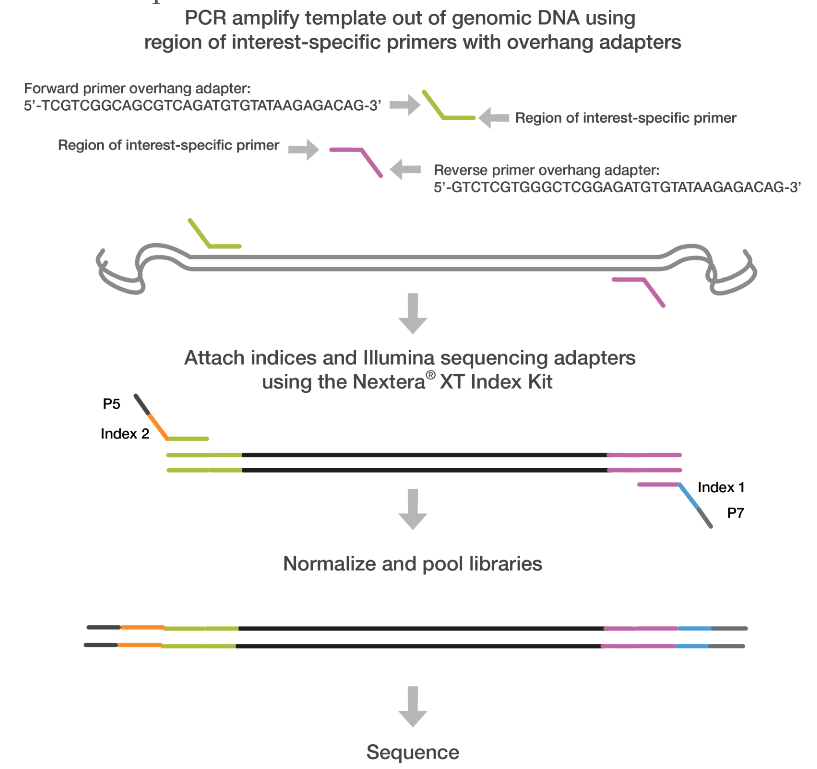
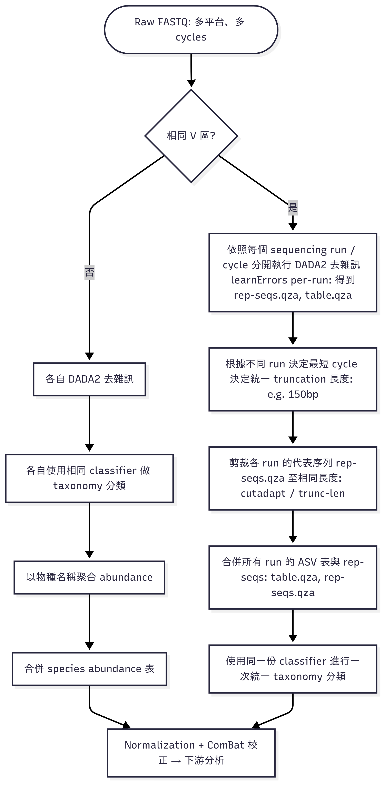
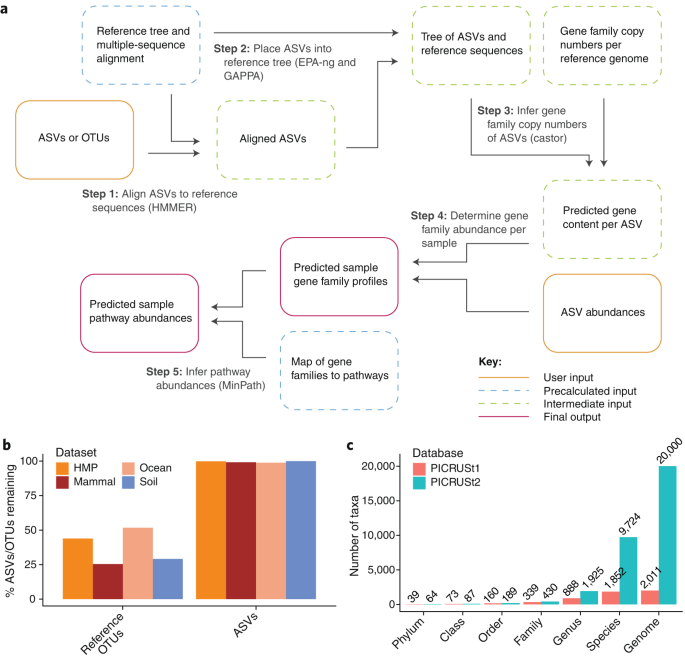

# FYLab 
* 20251008 updated
```
  + 新增序列模型資料庫: Greengenes2, Greengenes, SILVA [20251008]
  + Naive Bayesian 模型採用 V3-V4 段提升預測精準度 [20250728]
  + Naive Bayesian V3 段模型 [20251008]
  + Naive Bayesian V4 段模型 [20251008]
  + 新增調整denoise用的fastq長度查詢工具 [20250829]
  + 新增分流專案合併點 [20251008]
```
## Folder Management
* Window -> File WINSCP
* Mac -> Filezilla

主機名稱：140.127.97.45
使⽤者名稱：adprc

## Puty/terminal
Windos: Putty
  + IP: adprc@140.127.97.45

Mac: Terminal
  + run: ssh adprc@140.127.97.45


# Table of Content:
1. [FastQ files Preprocess：前處理Primer](#FastQ-files-Preprocess-前處理Primer)
2. [QIIME2 - Preparation: 分析前準備](#QIIME2---Preparation-分析前準備)
3. [QIIME2 - Import Data: 導入資料](#Import-Data-and-Preprocessing)
4. [QIIME2 - Analysis: 導出分類特徵表](#Analysis-分類導出特征表)
5. [Dehost - 排除host基因](#Dehost-排除host基因)
6. [畫圖](#畫圖)
7. [PICRUSt2 - Metabolism Pathway](#PICRUSt2---Metabolism-Pathway)


# FastQ files Preprocess 前處理Primer
FastQ現存現象:
* 舊機型上機(2×300 (600-cycle kit)): 有些有設定去除primer，不含primer的序列長度300 bp，但有少部分舊設定保有primer
* 新機型上機(2×300 (600-cycle kit)): 沒有額外設定，序列長度為含primer共計 300 bp
* 解決方法：統一所有FasqQ長度
  + 有prime的序列刪掉要去除掉primer
  + 沒primer的序列則保留不動，不切序列前段


## 啟用cutadapt環境
```
conda activate cutadapt310
```

## 建立一個資料夾放原始fastq檔
在自己的工作資料夾中，建立raw_fastq資料夾，並且移動所有fastq檔案至raw_fastq資料夾
```
mkdir raw_fastq
mv *.fastq.gz raw_fastq/
```

## 下載去除primer腳本與執行
```
curl -o trim_all.sh https://raw.githubusercontent.com/bing020815/FYLab/main/trim_all.sh
```

## 賦予執行權限
```
chmod +x trim_all.sh
```

## 執行去除primer腳本
* 腳本會尋找 raw_fastq/*_R1_*.fastq.gz 形式的檔案，請確認你已將 FASTQ 放在正確路徑下（raw_fastq/ 資料夾中）
* 剪完的檔案會輸出至 trimmed_fastq/ 目錄下
* raw_fastq/*_R1_*.fastq.gz 形式的檔案則不會被修改或刪除，需要清理空間時可優先清理這邊
```
./trim_all.sh
```

## 移動統一格式fastq資料至專案資料夾
* 將trimmed_fastq/ 目錄下所有剪完的fastq移動回專案資料夾下
* 會將舊存在的fastq覆蓋掉(原始fastq還是有在raw_fastq裡有保留)
```
mv -f trimmed_fastq/*.fastq.gz .
```

<p align="center"><a href="#fylab">Top</a></p>

# QIIME2 - Preparation 分析前準備

## 對檢體資料清單絕對路徑輸出(更新排除掉'file_path.txt'列入清單)
```
find . -maxdepth 1 -type f \( ! -name 'file_path.txt' ! -name 'trim_all.sh' \) -exec realpath {} \; > file_path.txt
```

## 留下檢體的絕對路徑資料,按照儲存格式存成manifest.csv
* (按照順序: R1_forward, R2_reverse)
``` csv
 # 此為範例格式，無需執行
 sample-id,absolute-filepath,direction
 CH4773,/home/fyadmin/Desktop/Hong-Ying/CL/CH4773_S29_L001_R1_01.fastq.gz,forward
 CH4773,/home/fyadmin/Desktop/Hong-Ying/CL/CH4773_S29_L001_R2_001.fastq.gz,reverse
```
<details>
<summary>(Optional) 確認file_path.txt檔案與處理資料</summary>

(option)確認'file_path.txt'的資料紀錄是否存在
```
cat file_path.txt
```
  (option1): 去除最後一行資料
  ```
  sed -i '$d' file_path.txt
  ```
  (option2): 去除最後一行資料
  ```
  head -n -1 file_path.txt > temp_file.txt && mv temp_file.txt file_path.txt
  ```
  (option3): 手動抓資料下來，移除file_path.txt資料紀錄後上傳上去
  ```
  使用excel修改
  ```

(option)確認file_path.txt的資料紀錄已移除
```
cat file_path.txt
```
</details><br>

## 生成 manifest.csv
```
echo "sample-id,absolute-filepath,direction" > manifest.csv && \
awk -F'/' '
BEGIN { OFS="," }
{
  file = $NF
  split(file, parts, "_")
  sample = parts[1]
  if (file ~ /_R1_/) dir = "forward"
  else if (file ~ /_R2_/) dir = "reverse"
  else next

  key = sample"-"dir
  if (!seen[key]++) {
    print sample, $0, dir
  }
}' file_path.txt >> manifest.csv
```

## 將表有csv轉成逗號分個的txt檔案 
* (fastq轉黨qiime2用)
```
cp manifest.csv manifest.txt
```

## 把逗號分隔的csv改成製表符\t的tsv 
* (metadata才需要用到)
```
sed 's/,/\t/g' manifest.csv > manifest.tsv
```

<p align="center"><a href="#fylab">Top</a></p>

# Import Data and Preprocessing
* 各專案可能長度與定序段:
  + 2×300 (600-cycle kit): MiSeq; V3–V4 (341F–805R)
  + 2×250 (500-cycle kit): MiSeq、HiSeq; V3–V4、V4
  + 2×200 (400-cycle kit): MiniSeq; V4（515F–806R）
  + 2×150 (300-cycle kit): NextSeq, NovaSeq, HiSeq ; V4
  + 2×100 (200-cycle kit): HiSeq; V4
* 各專案合併解決方法，可以依據目標段區域分類進行特殊狀況處理：
  1. [分流前處裡、ASV切齊、ASV合併、分類](#特殊狀況處理1-optional)
  2. [分流前處裡、分流分類、Taxa合併](#特殊狀況處理2-optional)

### 依據 [DADA2 官方 Big Data 工作流程](https://benjjneb.github.io/dada2/bigdata.html)
原文：“recommended to learn the error rates for each run individually … then merging those runs together into a full-study sequence table.” [在說明文件同頁也明講 “Sequences must cover the same gene region … Single-reads must also be truncated to the same length. (this is not necessary for overlapping paired-reads, as truncLen doesn’t affect the region covered by the merged reads)”]，

作者（Ben Callahan）在 GitHub issues 的逐字回覆:
+	“In order to successfully merge, your amplicons need to cover the same gene region. … So to merge, you need to trim the longer ASVs to exactly the gene region included in the shorter ASV table.”（[Issue #452](https://github.com/benjjneb/dada2/issues/452)） 
+	“As long as the datasets are from amplifying the same gene region, they can be simply merged (i.e. the ASVs will be consistent across the …).”（[Issue #482](https://github.com/benjjneb/dada2/issues/482)） 
+	“Just make sure to trim each run to the same gene region (i.e. same trimLeft for merged paired-end data, and same trimLeft and truncLen for …).”（[Issue #716](https://github.com/benjjneb/dada2/issues/716)）

QIIME 2 論壇（佐證 truncLen 與覆蓋區）:
+	“It’s fine to use different truncLen … The truncLen setting doesn’t affect the merged amplicon region, it just affects the amount of overlap …”（[QIME 2 Forum]((https://forum.qiime2.org/t/dada2-merging-and-comparing-different-data-sets/18326))） 

上述出處可以整體整理為幾點處理要點：
1) 「每個 sequencing run 應獨立學習錯誤率並進行樣本推斷（Sample Inference）」
2) 「各 run 完成後合併為全研究用的 sequence table」
3) 「合併前需確保序列涵蓋同一基因區（same amplicon region）」
4) 「嵌合體去除 (chimera removal) 與分類學指派 (classification) 可於各 run 或整體階段執行」



## 進入qiime2環境
```
conda activate qiime2-2023.2
```

## FASTQ 匯入轉檔 QIIME 2 可使用的格式 (.qza)
* (need to wait process time, use 'top' command to check, press 'q' to leave)
* 會產出 paired-end-demux.qza 檔案
* 依照manifest.txt將兩段序列配對打包封裝起來(未實際拼接兩段序列)
```
nohup qiime tools import --type 'SampleData[PairedEndSequencesWithQuality]' --input-path manifest.txt --output-path paired-end-demux.qza --input-format PairedEndFastqManifestPhred33 &
```

## 轉成可視化報表
* 利用 qza 檔案，轉黨輸出成qzv，可以畫成可視化報表
* https://view.qiime2.org/
```
nohup qiime demux summarize --i-data paired-end-demux.qza --o-visualization paired-end-demux.qzv &
```

## Denoise 去除雜訊 [標準流程: 270-240 (適用於fastq長度 300 bp)]
* 將qza檔案去完雜訊後，輸出成： table.qza, stats.qza, rep-seqs.qza 
* (need to take a long process time, use 'top'/'htop' command to check, press 'q' to leave)
* --p-trim-left-* 的數值應根據使用的 primer 長度設定，無法指定單獨的樣本做。
* --p-trunc-len-* 需保留足夠長度供 forward + reverse read 重疊（overlap）至少約 12 bp。
* 成功合併的條件公式: trunc_f – trim_f  +  trunc_r – trim_r  ≥ amplicon + min-overlap
* amplicon 則是 PCR 目標要放大的序列斷，可用於對應 reference Database 對照使用 (ex: Greengenes V3V4)
* 例如：270 + 240 = 510，V3-V4的 amplicon 長度為 約430~460 bp(可通則預設為460)，則 overlap 為 50 bp，屬於合理值(overlap 通常建議 >20-30 bp)
* (將雙端測序數據處理為高品質的序列數據，並輸出相關結果)
* 流程會先各自: (1)品值篩選 → (2,3) 建立錯誤模型、denoise（F / R）→ (4) 再合併 → (5) 再去 chimera → 再輸出 ASV
* 不足trucLen的reads會被剃除、去除可能是拼接自高豐度序列的 chimera (default method:consensus)
* table.qzv - 可以看到Sample的取樣深度
<details>
<summary><strong>檢查Fastq實際長度 [2025829 新增]</strong></summary>
  
  * 根據實際fastq長度，調整trunc範圍，以防因未達到條件被dada2大量去除
  * 如果使用短序列，通常要使用reads數最多的長度作為切點

抽樣查詢長度  
```
  zcat YourFastq_R1_trimmed.fastq.gz | \
  awk '(NR%4==2){print length($1)}' | \
  sort | uniq -c
```
查看整批所有長度
```
  zcat *.fastq.gz | \
  awk 'NR%4==2 {print length($0)}' | \
  sort | uniq -c | \
  awk '{print $2 "\t" $1}' | \
  tee >(awk '{sum+=$1*$2; n+=$2; if(min==""||$1<min)min=$1; if($1>max)max=$1} END{print "N="n, "Min="min, "Mean="sum/n, "Max="max}' >&2)
```
輸出所有長度清單 
```
  for f in *.fastq.gz; do
    mode=$(zcat "$f" | \
      awk 'NR%4==2 {print length($1)}' | \
      sort | uniq -c | sort -nr | head -1 | awk '{print $2}')
    echo -e "$f\t$mode"
  done > fastq_length_mode_list.txt
```
</details>

```
nohup qiime dada2 denoise-paired \
--i-demultiplexed-seqs paired-end-demux.qza \
--p-trim-left-f 0 --p-trim-left-r 0 \
--p-trunc-len-f 270 --p-trunc-len-r 240 \
--p-n-threads 2 \
--o-representative-sequences rep-seqs.qza \
--o-table table.qza \
--o-denoising-stats stats.qza > nohup.out 2>&1 &
```
## 紀錄denoise設定
```
echo "--p-trim-left-f 0 --p-trim-left-r 0" >> denoise_settings.txt
echo "--p-trunc-len-f 270 --p-trunc-len-r 240" >> denoise_settings.txt
```

### 檢查stats檔案denosis狀態圖表
* 利用 qza 檔案，轉黨輸出成qzv，可以畫成可視化報表
* stats.qzv - 確認denoise中的資訊。
* https://view.qiime2.org/
```
qiime metadata tabulate \
  --m-input-file stats.qza \
  --o-visualization stats.qzv
```
### 直接看序列表長度[optional]
* (產出rep-seqs-summary.qzv)
```
qiime feature-table tabulate-seqs \
  --i-data rep-seqs.qza \
  --o-visualization rep-seqs-summary.qzv
```

### 特殊狀況處理1 (optional)
<details>
<summary><strong>合併分流專案 [20251008 新增]</strong></summary>
  
  ## 根據實際專案需求，合併不同分流的專案
  * 分流專案A、分流專案的table.qza, rep-seqs.qza 複製到獨立資料夾
  * 將分流專案A的table.qza與分流專案B的table.qza合併
  * 將分流專案A的rep-seqs.qza與分流專案B的rep-seqs.qza合併

### 建立合併後導出用資料夾
創建合併導出用的資料夾，複製移動必要檔案(table.qza, rep-seqs.qza)，在此資料夾下進行合併、分類等步驟
```
  mkdir merge_exported
  cd merge_exported
```
根據要合併的專案群決定需要切齊的統一長度(最小的長度)
```
qiime cutadapt trim-reads \
  --i-demultiplexed-sequences rep-seqs1.qza \
  --p-length 430 \
  --o-trimmed-sequences rep-seqs1_trimed.qza

qiime cutadapt trim-reads \
  --i-demultiplexed-sequences rep-seqs2.qza \
  --p-length 430 \
  --o-trimmed-sequences rep-seqs2_trimed.qza
```
table.qza: ASV abundance table（特徵豐度表、又稱 feature table，帶有ASV ID）
```
  qiime feature-table merge \
  --i-tables table1.qza \
  --i-tables table2.qza \
  --o-merged-table table.qza
```
rep-seqs.qza: 每個 ASV 的實際 DNA 序列（即 16S 片段字串），實際需要合併，以及用於分類器分類的 input，實際需要合併，以及用於分類器分類的 input
```
  qiime feature-table merge-seqs \
  --i-data rep-seqs1_trimed.qza \
  --i-data rep-seqs2_trimed.qza \
  --o-merged-data rep-seqs.qza
```
[跳至倒出特徵表步驟](#Analysis-分類導出特征表)

</details>

# Analysis 分類導出特征表
## 建立導出用的資料夾
```
mkdir phyloseq
```
## 轉黨qza檔案成biom檔案
* 輸入去除雜訊後的table.qza，再輸出成biom format: feature-table.biom
```
qiime tools export \
--input-path table.qza \
--output-path phyloseq
```

## Biom 轉黨
* 將輸出成biom format的當案轉黨成otu_table.tsv 
* biom 記錄樣本與 OTU/ASV 之間的豐度矩陣
```
biom convert \
-i phyloseq/feature-table.biom \
-o phyloseq/otu_table.tsv \
--to-tsv
```

## 模型分類
根據資料庫預測代表序列的ASV，資料庫可採用 GreenGenes 16S rRNA gene database、SILVA ribosomal RNA database 兩大資料庫。
以及2022年，GreenGenes 16S rRNA gene database 更新改版的 Greengenes2 比對資料庫。

[International Code of Nomenclature of Prokaryotes (ICNP)](https://the-icsp.org/index.php) 

<details>
<summary><strong>Greengenes 13_8 16S [20250728 新增]</strong></summary>

GreenGenes 16S rRNA gene databas:
  + Greengene 1 13-8 只有更新到 2013.08，可參考序列數較多 (約 100,000 條)
  + Greengenes2 從 2022 年起開始重新建構，採用全基因體（WoL），但可參考序列數少 (約 21,000 條)

[Cite 參考資訊](https://docs.qiime2.org/2023.2/data-resources/)是由國際微生物學會聯盟（ICSP）制定的命名法律，期原則包含：
1. 名稱必須雙名制（binomial nomenclature）
    + 任何物種名稱都要由「屬名 + 種小名」兩部分組成，例如 Escherichia coli。
2. 屬名（Genus）首字母要大寫，種小名（species epithet）要小寫
    + Lactobacillus casei
3. 每個物種名稱必須唯一
    + 不同屬可共用相同 epithet（例如 Bacteroides faecis、Roseburia faecis），但完整名稱必須唯一。
4. 名稱要有 type strain（模式株）支持
    + 每個正式物種名稱都必須有對應的「模式菌株（type strain）」被註冊。
5. 命名必須經正式發表與認可
    + 需刊登於《International Journal of Systematic and Evolutionary Microbiology (IJSEM)》並被 ICSP 接受
  
菌新舊名查詢：
* [LPSN - List of Prokaryotic names with Standing in Nomenclature](https://lpsn.dsmz.de/)

### Option1: Naive Bayes 模型分類 (V3-V4) [Self-trained]
```
nohup qiime feature-classifier classify-sklearn \
--i-classifier /home/adprc/classifier/gg/gg_13_8_99_NB_classifier_V3V4.qza \
--i-reads rep-seqs.qza \
--o-classification taxonomy.qza \
--p-n-jobs 2 > nohup.out 2>&1 &
```

### Option1-1: Naive Bayes 模型分類 (V3) [Self-trained]
```
nohup qiime feature-classifier classify-sklearn \
--i-classifier /home/adprc/classifier/gg/gg_13_8_99_NB_classifier_V3_len200.qza.qza \
--i-reads rep-seqs.qza \
--o-classification taxonomy.qza \
--p-n-jobs 2 > nohup.out 2>&1 &
```

### Option1-2: Naive Bayes 模型分類 (V4) [Self-trained]
```
nohup qiime feature-classifier classify-sklearn \
--i-classifier /home/adprc/classifier/gg/gg_13_8_99_NB_classifier_V4_len250.qza \
--i-reads rep-seqs.qza \
--o-classification taxonomy.qza \
--p-n-jobs 2 > nohup.out 2>&1 &
```

### Option2: vsearch 模型分類 (full-length)
```
nohup qiime feature-classifier classify-consensus-vsearch \
  --i-query rep-seqs.qza \
  --i-reference-reads /home/adprc/classifier/gg/gg_13_8_99_RefSeq.qza \
  --i-reference-taxonomy /home/adprc/classifier/gg/gg_13_8_99_Taxonomy.qza \
  --p-threads 4 \
  --o-classification taxonomy.qza \
  --verbose > nohup_vsearch.out 2>&1 &
```

</details><br>

<details>
<summary><strong>Greengenes2 2022_10 16S [20251008 新增]</strong></summary>

Greengenes2 16S rRNA gene databas:
  + Greengenes2 從 2022 年起開始重新建構，以backbone技術，採用全基因體（WoL）。

[Qiime2 2023.2 Cite 參考資訊](https://docs.qiime2.org/2023.2/data-resources/)
### Option1: Naive Bayes 模型分類 (V3-V4) [Self-trained]
```
nohup qiime feature-classifier classify-sklearn \
--i-classifier /home/adprc/classifier/gg2/gg2_2022_10_backbone_NB_classifier_V3V4.qza \
--i-reads rep-seqs.qza \
--o-classification taxonomy.qza \
--p-n-jobs 2 > nohup.out 2>&1 &
```

### Option1-1: Naive Bayes 模型分類 (V3) [Self-trained]
```
nohup qiime feature-classifier classify-sklearn \
--i-classifier /home/adprc/classifier/gg2/gg2_2022_10_backbone_NB_classifier_V3_len200.qza \
--i-reads rep-seqs.qza \
--o-classification taxonomy.qza \
--p-n-jobs 2 > nohup.out 2>&1 &
```

### Option1-2: Naive Bayes 模型分類 (V4) [Official released]
```
nohup qiime feature-classifier classify-sklearn \
--i-classifier /home/adprc/classifier/gg2/gg2.2022.10.backbone.V4.nb.qza \
--i-reads rep-seqs.qza \
--o-classification taxonomy.qza \
--p-n-jobs 2 > nohup.out 2>&1 &
```

### Option2: vsearch 模型分類 (full-length)
```
nohup qiime feature-classifier classify-consensus-vsearch \
  --i-query rep-seqs.qza \
  --i-reference-reads /home/adprc/classifier/gg2/gg2_2022_10_RefSeq.qza \
  --i-reference-taxonomy /home/adprc/classifier/gg2/gg2_2022_10_Taxonomy.qza \
  --p-threads 4 \
  --o-classification taxonomy.qza \
  --verbose > nohup_vsearch.out 2>&1 &
```

</details><br>

<details>
<summary><strong>Greengenes2 2024_09 16S [20251008 新增]</strong></summary>

Greengenes2 16S rRNA gene databas:
  + Greengenes2 從 2024.09 年再次更新：
    * 遵照[LTP](https://imedea.uib-csic.es/mmg/ltp/)在 2023.08年發布的命名準則修正， e.g., Firmicutes -> Bacillota
    * 線粒體 (mitochondria) 葉綠體 (chloroplast) 的序列 在 Naive Bayes 分類器和 backbone taxonomy 中被明確納入
  + 擴充 ASV 數量 (多一百萬左右的 ASV)，擴充 5000 多筆 Taxanomy(總數維持約33萬筆)
  + 維持 backbone 樹結構

[Qiime2 2023.2 Cite 參考資訊](https://docs.qiime2.org/2023.2/data-resources/)
[Greengenes2 2024.09 Cite 參考資訊](https://forum.qiime2.org/t/greengenes2-2024-09/31606/4)

### Option1: Naive Bayes 模型分類 (V3-V4) [Self-trained]
```
nohup qiime feature-classifier classify-sklearn \
--i-classifier /home/adprc/classifier/gg2/gg2_2024_09_backbone_NB_classifier_V3V4.qza \
--i-reads rep-seqs.qza \
--o-classification taxonomy.qza \
--p-n-jobs 2 > nohup.out 2>&1 &
```

### Option1-1: Naive Bayes 模型分類 (V3) [Self-trained]
```
nohup qiime feature-classifier classify-sklearn \
--i-classifier /home/adprc/classifier/gg2/gg2_2024_09_backbone_NB_classifier_V3_len200.qza \
--i-reads rep-seqs.qza \
--o-classification taxonomy.qza \
--p-n-jobs 2 > nohup.out 2>&1 &
```

### Option1-2: Naive Bayes 模型分類 (V4) [official released]
```
nohup qiime feature-classifier classify-sklearn \
--i-classifier /home/adprc/classifier/gg2/gg2.2024.09.backbone.v4.nb.qza \
--i-reads rep-seqs.qza \
--o-classification taxonomy.qza \
--p-n-jobs 2 > nohup.out 2>&1 &
```

### Option2: vsearch 模型分類 (full-length)
```
nohup qiime feature-classifier classify-consensus-vsearch \
  --i-query rep-seqs.qza \
  --i-reference-reads /home/adprc/classifier/gg2/gg2_2024_09_RefSeq.qza \
  --i-reference-taxonomy /home/adprc/classifier/gg2/gg2_2024_09_Taxonomy.qza \
  --p-threads 4 \
  --o-classification taxonomy.qza \
  --verbose > nohup_vsearch.out 2>&1 &
```

</details><br>

<details>
<summary><strong>SILVA 138 16S [20250728 新增]</strong></summary>

SILVA ribosomal RNA database: 官方公開參考序列持續更新 (約 129,000 條)

[Qiime2 2023.2 Cite 參考資訊](https://docs.qiime2.org/2023.2/data-resources/)
  
### Option1: Naive Bayes 模型分類 (V3-V4) [Self-trained]
```
nohup qiime feature-classifier classify-sklearn \
--i-classifier /home/adprc/classifier/SILVA/silva_138_99_NB_classifier_V3V4.qza \
--i-reads rep-seqs.qza \
--o-classification taxonomy.qza \
--p-n-jobs 2 > nohup.out 2>&1 &
```

### Option1-1: Naive Bayes 模型分類 (V3) [Self-trained]
```
nohup qiime feature-classifier classify-sklearn \
--i-classifier /home/adprc/classifier/SILVA/silva_138_99_NB_classifier_V3_len200.qza \
--i-reads rep-seqs.qza \
--o-classification taxonomy.qza \
--p-n-jobs 2 > nohup.out 2>&1 &
```

### Option1-2: Naive Bayes 模型分類 (V4) [official released]
```
nohup qiime feature-classifier classify-sklearn \
--i-classifier /home/adprc/classifier/SILVA/silva-138-99-515-806_V4-nb-classifier.zip \
--i-reads rep-seqs.qza \
--o-classification taxonomy.qza \
--p-n-jobs 2 > nohup.out 2>&1 &
```

### Option2: vsearch 模型分類 (full-length)
```
nohup qiime feature-classifier classify-consensus-vsearch \
  --i-query rep-seqs.qza \
  --i-reference-reads /home/adprc/classifier/SILVA/silva_138_99_RefSeq.qza \
  --i-reference-taxonomy /home/adprc/classifier/SILVA/silva_138_99_Taxonomy.qzaa \
  --p-threads 4 \
  --o-classification taxonomy.qza \
  --verbose > nohup_vsearch.out 2>&1 &
```

</details><br>

<details>
<summary><strong>Greengenes 13_8 16S full-length</strong></summary>
  
### Step 1. 下載模型
* 下載 2023.09發布的Naive Bayes分類器，訓練用資料：GreenGenes 13_8，99% OTUs
* https://greengenes.lbl.gov/
* https://www.lcsciences.com/documents/sample_data/16S_sequencing/src/html/top2.html
```
wget https://data.qiime2.org/2023.9/common/gg-13-8-99-nb-classifier.qza
```

### Step2. Naive Bayes 模型分類
* 透過已訓練好的模型gg-13-8-99-nb-classifier.qza來預測，並輸出taxonomy.qza
* gg-13-8-99-nb-classifier.qza 要放在與 Fastq同層的資料夾，需要一些時間
```
nohup qiime feature-classifier classify-sklearn \
--i-classifier gg-13-8-99-nb-classifier.qza \
--i-reads rep-seqs.qza \
--o-classification taxonomy.qza \
--p-n-jobs 2 > nohup.out 2>&1 &
```

</details><br>

### 特殊狀況處理2 (optional)
<details>
<summary><strong>合併分流專案 [2025829 新增]</strong></summary>
  
  ## 根據實際專案需求，合併不同分流的專案
  * 分流專案A、分流專案的table.qza, taxonomy.qza, rep-seqs.qza 複製到獨立資料夾
  * 將分流專案A的table.qza與分流專案B的table.qza合併

### 建立合併後導出用資料夾
* 後續的dehost/pathway都可以在這個資料夾底下接續做
```
  mkdir merge_exported
  cd merge_exported
```
table.qza: ASV abundance table（特徵豐度表、又稱 feature table，帶有ASV ID）
```
  qiime feature-table merge \
  --i-tables table1.qza \
  --i-tables table2.qza \
  --o-merged-table table.qza
```
taxonomy.qza: 每個 ASV 序列對應到的生物分類（門、綱、目、科、屬、種）
```
  qiime feature-table merge-taxa \
  --i-data taxonomy1.qza \
  --i-data taxonomy2.qza \
  --o-merged-data taxonomy.qza
```
rep-seqs.qza: 每個 ASV 的實際 DNA 序列（即 16S 片段字串），實際需要合併，以及用於分類器分類的 input
```
  qiime feature-table merge-seqs \
  --i-data rep-seqs1.qza \
  --i-data rep-seqs2.qza \
  --o-merged-data rep-seqs.qza
```
[跳回倒出特徵表步驟](#Analysis-分類導出特征表)

</details>


## qza格式轉檔
*  將分類好的輸出檔案taxonomy.qza轉黨為成taxonomy.tsv，存至phyloseq
```
qiime tools export \
--input-path taxonomy.qza \
--output-path phyloseq
```

### -- 解壓縮 rep-seqs.qza 檔案，產生dna-sequences.fasta，方便查詢Sequence、篩選350bp長度 --
* https://blast.ncbi.nlm.nih.gov/Blast.cgi?PAGE_TYPE=BlastSearch&BLAST_SPEC=MicrobialGenomes
```
qiime tools export \
  --input-path rep-seqs.qza \
  --output-path phyloseq
```

<p align="center"><a href="#fylab">Top</a></p>

# Dehost 排除host基因
## 啟動host-tools package 

包含: bowtie2, samtools, seqkit 工具包 
https://useast.ensembl.org/index.html
```
conda activate host-tools
```
### Step 1: 檢查代表性序列品質（QC）
```
seqkit stats phyloseq/dna-sequences.fasta
```

### Step 2: 加強篩選與過濾（可選）
* 去除R1, R2合併後小於 350 bp序列
* 保守篩選濾除低於 350 bp 序列，減少過多序列定序停留於Family
* 需要高品質、高分類準確度的研究，例如 菌種層級分析、生物標記開發
```
nohup seqkit seq -m 350 -M 500 -v phyloseq/dna-sequences.fasta -o phyloseq/filtered_dna-sequences.fasta &
```

### Step 3: 再檢查代表性序列品質（QC）
<details>
<summary><strong>使用加強篩選與過濾後語法</strong></summary>

```
seqkit stats phyloseq/filtered_dna-sequences.fasta
```
</details><br>
<details>
<summary><strong>未使用加強篩選與過濾語法</strong></summary>

```
seqkit stats phyloseq/dna-sequences.fasta
```
</details><br>

## 使用 Bowtie2 比對至[人類human/老鼠mouse/狗dog/貓cat/綜合物種all]基因組

<details>
<summary><strong>請選擇一項適合專案的基因組執行dehost</strong></summary>

  ### human [pick one fits the project]
  <details>
  <summary><strong>使用加強篩選與過濾後語法</strong></summary>
  
  ```
  nohup bowtie2 -x /home/adprc/host_genome/human_genome/host_genome_index \
         -f phyloseq/filtered_dna-sequences.fasta \
         -S phyloseq/mapping_host_genome.sam \
         -p 2 \
         2> phyloseq/mapping_host_genome.txt &
  ```
  </details><br>
  <details>
  <summary><strong>未使用加強篩選與過濾語法</strong></summary>
  
  ```
  nohup bowtie2 -x /home/adprc/host_genome/human_genome/host_genome_index \
         -f phyloseq/dna-sequences.fasta \
         -S phyloseq/mapping_host_genome.sam \
         -p 2 \
         2> phyloseq/mapping_host_genome.txt &
  ```
  </details><br>
  
  ### mouse [pick one fits the project]
  <details>
  <summary><strong>使用加強篩選與過濾後語法</strong></summary>
  
  ```
  nohup bowtie2 -x /home/adprc/host_genome/mouse_genome/host_genome_index \
         -f phyloseq/filtered_dna-sequences.fasta \
         -S phyloseq/mapping_host_genome.sam \
         -p 2 \
         2> phyloseq/mapping_host_genome.txt &
  ```
  </details><br>
  <details>
  <summary><strong>未使用加強篩選與過濾語法</strong></summary>
  
  ```
  nohup bowtie2 -x /home/adprc/host_genome/mouse_genome/host_genome_index \
         -f phyloseq/dna-sequences.fasta \
         -S phyloseq/mapping_host_genome.sam \
         -p 2 \
         2> phyloseq/mapping_host_genome.txt &
  ```
  </details><br>

  ### dog [pick one fits the project]
  <details>
  <summary><strong>使用加強篩選與過濾後語法</strong></summary>
  
  ```
  nohup bowtie2 -x /home/adprc/host_genome/dog_genome/host_genome_index \
         -f phyloseq/filtered_dna-sequences.fasta \
         -S phyloseq/mapping_host_genome.sam \
         -p 2 \
         2> phyloseq/mapping_host_genome.txt &
  ```
  </details><br>
  <details>
  <summary><strong>未使用加強篩選與過濾語法</strong></summary>
  
  ```
  nohup bowtie2 -x /home/adprc/host_genome/dog_genome/host_genome_index \
         -f phyloseq/dna-sequences.fasta \
         -S phyloseq/mapping_host_genome.sam \
         -p 2 \
         2> phyloseq/mapping_host_genome.txt &
  ```
  </details><br>
  
  
  ### cat [pick one fits the project]
  <details>
  <summary><strong>使用加強篩選與過濾後語法</strong></summary>
  
  ```
  nohup bowtie2 -x /home/adprc/host_genome/cat_genome/host_genome_index \
         -f phyloseq/filtered_dna-sequences.fasta \
         -S phyloseq/mapping_host_genome.sam \
         -p 2 \
         2> phyloseq/mapping_host_genome.txt &
  ```
  </details><br>
  <details>
  <summary><strong>未使用加強篩選與過濾語法</strong></summary>
  
  ```
  nohup bowtie2 -x /home/adprc/host_genome/cat_genome/host_genome_index \
         -f phyloseq/dna-sequences.fasta \
         -S phyloseq/mapping_host_genome.sam \
         -p 2 \
         2> phyloseq/mapping_host_genome.txt &
  ```
  </details><br>
  
  ### all(human, mouse, dog, cat, cattle, duck, goat, horse, pig, rabbit, turkey, chicken, sheep) [pick one fits the project]
  <details>
  <summary><strong>使用加強篩選與過濾後語法</strong></summary>
  
  ```
  nohup bowtie2 -x /home/adprc/host_genome/all_genome/host_genome_index \
         -f phyloseq/filtered_dna-sequences.fasta \
         -S phyloseq/mapping_host_genome.sam \
         -p 2 \
         2> phyloseq/mapping_host_genome.txt &
  ```
  </details><br>
  <details>
  <summary><strong>未使用加強篩選與過濾語法</strong></summary>
  
  ```
  nohup bowtie2 -x /home/adprc/host_genome/all_genome/host_genome_index \
         -f phyloseq/dna-sequences.fasta \
         -S phyloseq/mapping_host_genome.sam \
         -p 2 \
         2> phyloseq/mapping_host_genome.txt &
  ```
  </details><br>
</details><br>

## samtools 處理宿主基因
### 1.將 .sam 轉換為 .bam（二進位格式，處理效率更高）
```
samtools view -h -b phyloseq/mapping_host_genome.sam -o phyloseq/mapping_host_genome.bam
```
### 2.篩選出「成功比對上的宿主序列」
```
samtools view -h -b -F 4 phyloseq/mapping_host_genome.bam > phyloseq/mapped_host_genome.bam
```
### 3.排序 BAM 檔（按 read name）
```
samtools sort -n phyloseq/mapped_host_genome.bam -o phyloseq/sorted.bam
```
### 4.把比對上的宿主 reads 轉回 FASTA
```
samtools fasta -@ 2 phyloseq/sorted.bam -F 4 -0 phyloseq/host_reads.fasta
```
### 5.篩選出「未比對上的非宿主序列」
```
samtools view -h -b -f 4 phyloseq/mapping_host_genome.bam > phyloseq/nonhost.bam
```
### 6.排序未比對序列
```
samtools sort -n phyloseq/nonhost.bam -o phyloseq/nonhost_sorted.bam
```
### 7.匯出非宿主 reads 為 FASTA
```
samtools fasta -@ 2 phyloseq/nonhost_sorted.bam -f 4 -0 phyloseq/nonhost.fasta
```
### 查看host基因佔比 [option1]
* overall alignment rate: 宿主基因佔比
```
cat phyloseq/mapping_host_genome.txt
```
### 查看host基因佔比 [option2]
* dna-sequences.fasta: 原始代表性序列（未過濾長度）
* filtered_dna-sequences.fasta: 只保留長度 350~500 bp 的序列
* host_reads.fasta: 成功比對到宿主的序列（被剃除）
* nonhost.fasta: 未比對到宿主的序列（保留分析）
```
seqkit stats -T phyloseq/*.fasta | awk '{print $1, $4}' | column -t
```
## 輸出去除宿主基因otu_table.tsv, taxonomy.tsv
### 0.建立filtered資料夾
```
mkdir -p phyloseq/filtered_host
```
### 1.建立keep_ids
```
grep '^>' phyloseq/nonhost.fasta | sed 's/^>//' > phyloseq/filtered_host/keep_ids.txt
```
### 2.建立 dehost_taxonomy.tsv
```
awk 'FNR==NR {keep[$1]; next} FNR==1 || $1 in keep' phyloseq/filtered_host/keep_ids.txt phyloseq/taxonomy.tsv > phyloseq/filtered_host/dehost_taxonomy.tsv
```
### 3.建立 dehost_otu_table.tsv
```
awk 'FNR==NR {keep[$1]; next} FNR<=2 || $1 in keep' phyloseq/filtered_host/keep_ids.txt phyloseq/otu_table.tsv > phyloseq/filtered_host/dehost_otu_table.tsv
```
## 進入qiime2環境
```
conda activate qiime2-2023.2
```
### 1. Dehost pathway 流程前期準備: dehost_otu_table.tsv 轉檔 dehost_otu_table.biom
```
biom convert \
  -i phyloseq/filtered_host/dehost_otu_table.tsv \
  -o phyloseq/filtered_host/dehost_otu_table.biom \
  --to-hdf5 \
  --table-type="OTU table"
```
### 2. Dehost pathway 流程前期準備: 把 dehost_otu_table.biom 匯入為 QIIME2 格式
```
qiime tools import \
  --input-path phyloseq/filtered_host/dehost_otu_table.biom \
  --type 'FeatureTable[Frequency]' \
  --input-format BIOMV210Format \
  --output-path phyloseq/filtered_host/dehost_otu_table.qza
```
### 3. Dehost pathway 流程前期準備: 從原始 rep-seqs.qza 過濾出 dehost 用的 rep-seqs.qza
```
qiime feature-table filter-seqs \
  --i-data rep-seqs.qza \
  --i-table phyloseq/filtered_host/dehost_otu_table.qza \
  --o-filtered-data phyloseq/filtered_host/dehost_rep_seqs.qza
```
### 4. 把 taxonomy.qza 過濾出與 dehost 一致的分類結果
```
qiime tools import \
  --input-path phyloseq/filtered_host/dehost_taxonomy.tsv \
  --type 'FeatureData[Taxonomy]' \
  --output-path phyloseq/filtered_host/dehost_taxonomy.qza \
  --input-format HeaderlessTSVTaxonomyFormat
```
### 5. Dehost pathway 流程前期準備: 匯出 過濾出 dehost 用的 rep-seqs.fasta
```
qiime tools export \
  --input-path phyloseq/filtered_host/dehost_rep_seqs.qza \
  --output-path phyloseq/filtered_host/
```

<p align="center"><a href="#fylab">Top</a></p>

# 畫圖
## KEGG Pathway 前期準備
### 1.Phylogeny Tree (此步驟要超級久，可以多線程設定)
<details>
<summary><strong>Dehost使後用語法</strong></summary>

```
nohup qiime phylogeny align-to-tree-mafft-fasttree \
--i-sequences phyloseq/filtered_host/dehost_rep_seqs.qza \
--o-alignment aligned-rep-seqs.qza \
--o-masked-alignment masked-aligned-rep-seqs.qza \
--o-tree unrooted-tree.qza \
--o-rooted-tree rooted-tree.qza \
--p-n-threads 2 > nohup.out 2>&1 &
```
</details><br>
<details>
<summary><strong>未Dehost使後語法</strong></summary>

```
nohup qiime phylogeny align-to-tree-mafft-fasttree \
--i-sequences rep-seqs.qza \
--o-alignment aligned-rep-seqs.qza \
--o-masked-alignment masked-aligned-rep-seqs.qza \
--o-tree unrooted-tree.qza \
--o-rooted-tree rooted-tree.qza \
--p-n-threads 2 > nohup.out 2>&1 &
```
</details><br>


### 2.導出代表序列 (這步完成後，可以跳到 #PICRUSt2，直接啟動picrust2)
<details>
<summary><strong>Dehost使後用語法</strong></summary>

註: 產出dehost過的dna-sequences.fasta 於 `phyloseq/filtered_host/`
```
qiime tools export --input-path phyloseq/filtered_host/dehost_rep_seqs.qza --output-path phyloseq/filtered_host/
```
</details><br>
<details>
<summary><strong>未Dehost使後語法</strong></summary>
  
註: 產出dehost過的dna-sequences.fasta 於 `fastq1/`
```
qiime tools export --input-path rep-seqs.qza --output-path fastq1/
```
</details><br>

<p align="center"><a href="#fylab">Top</a></p>

<details>
<summary><strong>點我展開畫進化樹(optional)</strong></summary>
  
### 3.導出無根進化樹 [optional]
```
qiime tools export \
--input-path unrooted-tree.qza \
--output-path phyloseq
cd phyloseq; mv tree.nwk unrooted_tree.nwk; cd ../
```

### 4.導出有根進化樹 [optional]
```
qiime tools export \
--input-path rooted-tree.qza \
--output-path phyloseq
cd phyloseq; mv tree.nwk rooted_tree.nwk; cd ../
```
</details><br>


  
## OTU Bar Plot [optional]

<details>
<summary><strong>點我展開畫OTU圖</strong></summary>

### 產出taxa-bar.qzv
```
qiime taxa barplot \
  --i-table table.qza \
  --m-metadata-file metadata.tsv \
  --i-taxonomy taxonomy.qza \
  --o-visualization taxa-bar.qzv
```
</details><br>

## OTU Percentage(如果有要跑bar圖就要接著跑這個)  [optional]

<details>
<summary><strong>點我展開畫OTU圖</strong></summary>

### 1.Taxanomy Collapse
```
qiime taxa collapse \
--i-table table.qza \
--i-taxonomy taxonomy.qza \
--p-level 7 \
--o-collapsed-table collapse-table.qza
```

### 2.Relative Frequency  [optional]
```
qiime feature-table relative-frequency \
--i-table collapse-table.qza \
--o-relative-frequency-table relative-table.qza
```

### 3.Export  [optional]
```
qiime tools export \
--input-path relative-table.qza \
--output-path export-relative-table
```

### 4.Convert BIOM to TSV (最後用convert-relative-table.tsv上greengene網站跑圖)  [optional]
```
biom convert \
-i export-relative-table/feature-table.biom \
-o convert-relative-table.tsv \
--to-tsv \
--header-key taxonomy
```
</details><br>


  
## Diversity  [optional]
<details>
<summary><strong>點我展開畫Diversity圖</strong></summary>
  
### 1.
```
qiime diversity core-metrics-phylogenetic \
--i-phylogeny rooted-tree.qza \
--i-table table.qza \
--p-sampling-depth _ \
--m-metadata-file metadata.tsv \
--output-dir metrics
```
註:sample depth - 通常會以table.qzv中，觀察 樣本深度最低的數值做為sample depth的數值，才能取樣到所有樣本，若最低的與其他樣本落差太大，則取倒數第二低的數值。


## Alpha Diversity  [optional]
### 1.Alpha 稀疏曲線
```
qiime diversity alpha-rarefaction \
--i-table table.qza \
--p-max-depth _ \ 
--i-phylogeny rooted-tree.qza \
(--m-metadata-file metadata.tsv) \
--o-visualization rare.qzv
```

### 2.Shannon
```
qiime diversity alpha-group-significance \
--i-alpha-diversity metrics/shannon_vector.qza \
--m-metadata-file metadata.tsv \
--o-visualization metrics/shannon_vector.qzv
```

## Beta Diversity  [optional]
### weighted_unifrac
```
qiime diversity beta-group-significance \
--i-distance-matrix metrics/weighted_unifrac_distance_matrix.qza \
--m-metadata-file metadata.tsv \
--m-metadata-column group \
--o-visualization metrics/weighted_unifrac-group-significance.qzv \
--p-pairwise
```
註:
weighted_unifrac
unweighted_unifrac
bray_curtis
jaccard


## Exit QIIME2  [optional]
```
conda deactivate
```
</details><br>

<p align="center"><a href="#fylab">Top</a></p>

# PICRUSt2 - Metabolism Pathway


KEGG 功能: 
1. 建構參考樹(Reference Tree)
  * 內建 backbone Tree 來自 Greengenes 13_5（約 20,000 條 16S 序列）
  * 每個 node（菌株）在 IMG(Integrated Microbial Genomes) 資料庫中有功能註解
2. 樣本序列放置 (EPA-NG placement)
  * 將 dna-sequences.fasta（DADA2 輸出之代表序列）放到上述 reference tree 上
  * 根據與參考菌株的演化距離找出最相似節點
3. 功能推估 (Hidden State Prediction, HSP)
  * 將該節點對應的 IMG 對照 KEGG 功能表（KO 拷貝數）推估至 ASV 節點
4. 樣本功能彙整
  * 將每個樣本中 ASV 的豐度 × 功能拷貝數 加總，輸出 pred_metagenome_unstrat.tsv(ASV 層級的功能表); path_abun_unstrat.tsv(樣本層級的 KEGG pathway abundance)

## 啟動PICRUSt2 package
* PICRUSt2 2.5.2 --> 40,000筆序列建製 reference database
* [PICRUSt2 2.6.0^ --> PICRUSt2-SC based on Genome Taxonomy Database (GTDB) r214 所建制的基因組與樹](https://pmc.ncbi.nlm.nih.gov/articles/PMC12089645/?utm_source=chatgpt.com)
```
conda activate picrust2
```

## 1.Place reads into reference tree (此階段需跑一下)

<details>
<summary><strong>Dehost使後用語法</strong></summary>
  
-p 可改設定核心 能設定為4-6
+ 就算最後 log 出現 Exit 1，只要產生的 out.tre 與 place_seqs_out/ 資料夾存在且完整，就可繼續執行後續流程
```
nohup place_seqs.py \
-s phyloseq/filtered_host/dna-sequences.fasta \
-o out.tre \
-p 2 \
--intermediate intermediate/place_seqs &
```
</details><br>
<details>
<summary><strong>未Dehost使用語法</strong></summary>
  
-p 可改設定核心 能設定為4-6
```
nohup place_seqs.py \
-s fastq1/dna-sequences.fasta \
-o out.tre \
-p 2 \
--intermediate intermediate/place_seqs &
```
</details><br>

## 2.Hidden-state prediction
```
nohup hsp.py \
-i 16S \
-t out.tre \
-o marker_predicted_and_nsti.tsv.gz \
-p 2 \
-n &
```
KO
```
nohup hsp.py \
-i KO \
-t out.tre \
-o KO_predicted.tsv.gz \
-p 2 &
```
EC
```
nohup hsp.py \
-i EC \
-t out.tre \
-o EC_predicted.tsv.gz \
-p 2 &
```

## 3.Generate metagenome predictions
KO
<details>
<summary><strong>Dehost使後用語法</strong></summary>

```
nohup metagenome_pipeline.py \
-i phyloseq/filtered_host/dehost_otu_table.biom \
-m marker_predicted_and_nsti.tsv.gz \
-f KO_predicted.tsv.gz \
-o KO_metagenome_out \
--strat_out &
```
</details><br>
<details>
<summary><strong>未Dehost使用語法</strong></summary>

```
nohup metagenome_pipeline.py \
-i phyloseq/feature-table.biom \
-m marker_predicted_and_nsti.tsv.gz \
-f KO_predicted.tsv.gz \
-o KO_metagenome_out \
--strat_out &
```
</details><br>

EC
<details>
<summary><strong>Dehost使後用語法</strong></summary>

```
nohup metagenome_pipeline.py \
-i phyloseq/filtered_host/dehost_otu_table.biom \
-m marker_predicted_and_nsti.tsv.gz \
-f EC_predicted.tsv.gz \
-o EC_metagenome_out \
--strat_out &
```
</details><br>
<details>
<summary><strong>未Dehost使用語法</strong></summary>

```
nohup metagenome_pipeline.py \
-i phyloseq/feature-table.biom \
-m marker_predicted_and_nsti.tsv.gz \
-f EC_predicted.tsv.gz \
-o EC_metagenome_out \
--strat_out &
```
</details><br>


## 4.KEGG pathway
# KEGG pathway - overview
```
nohup pathway_pipeline.py \
-i KO_metagenome_out/pred_metagenome_unstrat.tsv.gz \
-o KEGG_pathways_out \
--no_regroup \
--map /home/adprc/miniconda3/envs/picrust2/lib/python3.8/site-packages/picrust2/default_files/pathway_mapfiles/KEGG_pathways_to_KO.tsv \
-p 2 &
```
```
nohup add_descriptions.py \
-i KEGG_pathways_out/path_abun_unstrat.tsv.gz \
--custom_map_table /home/adprc/miniconda3/envs/picrust2/lib/python3.8/site-packages/picrust2/default_files/description_mapfiles/KEGG_pathways_info.tsv.gz \
-o KEGG_pathways_out/path_abun_unstrat_descrip.tsv.gz &
```
# EC path
```
nohup add_descriptions.py \
-i EC_metagenome_out/pred_metagenome_unstrat.tsv.gz \
-m EC \
-o EC_metagenome_out/path_abun_unstrat_descrip.tsv.gz  &
```
```
nohup add_descriptions.py \
  -i EC_metagenome_out/pred_metagenome_unstrat.tsv.gz \
  -m EC \
  -o EC_metagenome_out/pred_metagenome_unstrat_descrip.tsv.gz  &
```

# KO pathway - KO under Pathway
```
nohup add_descriptions.py \
  -i KO_metagenome_out/pred_metagenome_unstrat.tsv.gz \
  -m KO \
  -o KO_metagenome_out/pred_metagenome_unstrat_descrip.tsv.gz &
```


<p align="center"><a href="#fylab">Top</a></p>

# Key files relationship
* rep_seqs.qza: QIIME2 .qza 物件, 代表性序列（代表每個 feature 的 DNA 序列, 建立分類器、taxonomy 指派、畫 phylogeny
* taxonomy.qza: QIIME2 .qza 物件, 每條序列對應到的分類資訊（Domain → Species）, 繪製分類組成圖、群落分析
* otu_table.qza: QIIME2 .qza 物件, 每筆樣本與每條 feature 的 abundance 表（ASV/OTU 數量）,多樣性分析、群落結構比較
* dna-sequences.fasta: FASTA（非 QIIME2 格式）,rep_seqs.qza 轉成人可讀的序列格式, 外部工具使用（如 dehost、seqkit、bowtie2 等）
```
DADA2 / Deblur 處理原始 FASTQ 檔案
       │
       ├──→ rep_seqs.qza   ←──────→  (匯出為 fasta) → dna-sequences.fasta
       │                         ↑                     ↑
       ├──→ otu_table.qza        │                     │
       │                         │                     │
       └──→ rep_seqs.qza ──→ classify-sklearn → taxonomy.qza
```

# raw_data structure  [optional]
```
 . 
├── 科研案A
│   └── human
│       └── Stool
│       └── YF
│       └── Stomach
│       └── YF
│   └── metadata
├── 科研案B
│   └── metadata
│   └── human
│       └── Stool
│             └── Fastq 
│             └── Basespace 
│                    └── *BasespaceFiles
│                    └── *SampleTable
│                              └── SampleA.csv
│                              └── SampleB.csv …
│                    └── PopulationTable
│                              └── PopulationTable_abundance.csv
│                              └── PopulationTable_reads.csv
│             └── Qiime2 
│                    └── *Qiime_ver
│                            └── *SampleTable
│                            └── TabularTable
│                                    └── microbes_tabular_level_type_Qiimer_ver.csv
│                                    └── pathway_tabular__Qiimer_ver.csv
│                                    └── enzyme_tabular__Qiimer_ver.csv
│                            └── PopulationTable
│                                    └── PopulationTable_abundance.csv
│                                    └── PopulationTable_reads.csv  
│                                    └── PopulationTable_pathway.csv
│                                    └── PopulationTable_enzyme.csv
│                            └── EC_metagenome_out
│                                    └── pred_metagenome_unstrat_descrip.tsv.gz
│                            └── KEGG_pathways_out
│                                    └── path_abun_unstrat_descrip.tsv.gz
│                            └── KO_metagenome_out
│                            └── raw
│                                    └── otu_table.tsv
│                                    └── taxonomy.tsv
│                                    └── dehost_otu_table.tsv
│                                    └── dehost_taxonomy.tsv
│                                    └── dna-sequences.fasta
│                                    └── denoise_settings.txt
└── 商業案-廠商A 
```
