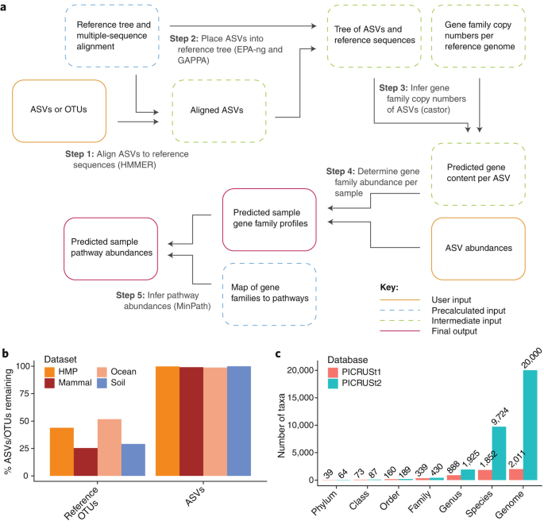

# FYLab 分析流程
基因定序上游分析流程使用說明，或是使用[舊流程觀看對照](./docs/old_sop.md)

* 20260415 updated
```
  + 分流Pre-upstrean [20260415]
```

# Table of Contents:
0. [|Pre-upstream| 初始設定](#Preset)
1. [|Pre-upstream| 序列前處理與導入](#序列前處理與導入)
2. [|Post-upstream| QIIME2 - Analysis: 模型分類導出特征表](#Analysis-模型分類導出特征表)
3. [|Post-upstream| Dehost - 排除host基因](#Dehost-排除host基因)
4. [|Post-upstream| 畫圖](#畫圖)
5. [|Post-upstream| PICRUSt2 - Metabolism Pathway](#PICRUSt2---Metabolism-Pathway)
6. [|Downstream taxonomy analysis| 下游分析處理](./docs/downstream.md)

# Preset
## Folder Management
* Window -> File WINSCP
* Mac -> Filezilla

主機名稱：140.127.97.66
使⽤者名稱：adprc

## Puty/terminal
Windos: Putty
  + IP: adprc@140.127.97.66

Mac: Terminal
  + run: ssh adprc@140.127.97.66
<p align="center"><a href="#fylab">Top</a></p>


# 序列前處理與導入
Pre-upstream 步驟請依資料來源選擇平台：
1. [|Pre-upstream| MiSeq / Illumina: 前處理與導入](./docs/miseq_pre_upstream.md)
2. [|Pre-upstream| PacBio HiFi 16S: 前處理與導入](./docs/pacbio_pre_upstream.md)

<p align="center"><a href="#fylab">Top</a></p>

# Analysis 模型分類導出特征表
NOTE:
* 本段適用於所有已完成 pre-upstream 的專案。 
* 無論來源為 MiSeq / Illumina 或 PacBio HiFi 16S，只要專案資料夾根目錄下已具備以下共用中繼檔案，即可從此處開始：
  - `table.qza` >> 合併分流專案檔使用
  - `rep-seqs.qza` >> 客製化分類器使用
  - `otu_table.tsv` >> dehost使用

## 執行黨下載
```bash
mkdir -p shell_tools
cd shell_tools
curl -O https://raw.githubusercontent.com/bing020815/FYLab/main/scripts/post_upstream/export_table_qza_to_phyloseq.sh
chmod +x export_table_qza_to_phyloseq.sh
cd ..
```


### 資料庫預測代表序列
根據資料庫預測代表序列的ASV，資料庫可採用 GreenGenes 16S rRNA gene database、SILVA ribosomal RNA database 兩大資料庫。
以及2022年，GreenGenes 16S rRNA gene database 更新改版的 Greengenes2 比對資料庫。

[International Code of Nomenclature of Prokaryotes (ICNP)](https://the-icsp.org/index.php)是由國際微生物學會聯盟（ICSP）制定的命名法律，期原則包含：
1. 名稱必須雙名制（binomial nomenclature）
    + 任何物種名稱都要由「屬名 + 種小名」兩部分組成，例如 Escherichia coli。
2. 屬名（Genus）首字母要大寫，種小名（species epithet）要小寫
    + Lactobacillus casei
3. 每個物種名稱必須唯一
    + 不同屬可共用相同 epithet（例如 Bacteroides faecis、Roseburia faecis），但完整名稱必須唯一。
4. 名稱要有 type strain（模式株）支持
    + 每個正式物種名稱都必須有對應的「模式菌株（type strain）」被註冊。
5. 命名必須經正式發表與認可
    + 需刊登於《International Journal of Systematic and Evolutionary Microbiology (IJSEM)》並被 ICSP 接受
  
菌新舊名查詢：
* [LPSN - List of Prokaryotic names with Standing in Nomenclature](https://lpsn.dsmz.de/) 

<details>
<summary><strong>Greengenes 13_8 16S [20260419 修正]</strong></summary>

GreenGenes 16S rRNA gene databas:
  + Greengene 1 13-8 只有更新到 2013.08，可參考序列數較多
    * ASV 數量約40萬筆，Taxonomy 總數維持約20.3萬筆
  + Greengenes2 從 2022 年起開始重新建構，採用全基因體（WoL）

[Cite 參考資訊](https://docs.qiime2.org/2023.2/data-resources/)

### Option1: Naive Bayes 模型分類 (V3-V4) [Self-trained]
```bash
JOB_TYPE=taxonomy \
PROJECT_DIR=. \
JOB_NAME=gg_nb_v3v4 \
CMD='qiime feature-classifier classify-sklearn \
  --i-classifier /home/adprc/classifier/gg/gg_13_8_99_NB_classifier_V3V4.qza \
  --i-reads rep-seqs.qza \
  --o-classification taxonomy.qza \
  --p-n-jobs 2' \
./shell_tools/run_in_tmux.sh
```

### Option1-1: Naive Bayes 模型分類 (V3) [Self-trained]
```bash
JOB_TYPE=taxonomy \
PROJECT_DIR=. \
JOB_NAME=gg_nb_v3 \
CMD='qiime feature-classifier classify-sklearn \
  --i-classifier /home/adprc/classifier/gg/gg_13_8_99_NB_classifier_V3_len200.qza \
  --i-reads rep-seqs.qza \
  --o-classification taxonomy.qza \
  --p-n-jobs 2' \
./shell_tools/run_in_tmux.sh
```

### Option1-2: Naive Bayes 模型分類 (V4) [Self-trained]
```bash
JOB_TYPE=taxonomy \
PROJECT_DIR=. \
JOB_NAME=gg_nb_v4 \
CMD='qiime feature-classifier classify-sklearn \
  --i-classifier /home/adprc/classifier/gg/gg_13_8_99_NB_classifier_V4_len250.qza \
  --i-reads rep-seqs.qza \
  --o-classification taxonomy.qza \
  --p-n-jobs 2' \
./shell_tools/run_in_tmux.sh
```

### Option2: vsearch 模型分類 (full-length)
```bash
JOB_TYPE=taxonomy \
PROJECT_DIR=. \
JOB_NAME=gg_vsearch_full \
CMD='qiime feature-classifier classify-consensus-vsearch \
  --i-query rep-seqs.qza \
  --i-reference-reads /home/adprc/classifier/gg/gg_13_8_99_RefSeq.qza \
  --i-reference-taxonomy /home/adprc/classifier/gg/gg_13_8_99_Taxonomy.qza \
  --p-threads 4 \
  --o-classification taxonomy.qza \
  --verbose' \
./shell_tools/run_in_tmux.sh
```

</details><br>

<details>
<summary><strong>Greengenes2 2022_10 16S [20260419 修正]</strong></summary>

Greengenes2 16S rRNA gene databas:
  + Greengenes2 從 2022 年起開始重新建構，以backbone技術，採用全基因體（WoL）。
  + ASV 數量約66萬筆，Taxonomy 總數維持約33.1萬筆

[Qiime2 2023.2 Cite 參考資訊](https://docs.qiime2.org/2023.2/data-resources/)
### Option1: Naive Bayes 模型分類 (V3-V4) [Self-trained]
```bash
JOB_TYPE=taxonomy \
PROJECT_DIR=. \
JOB_NAME=gg2_2022_10_nb_v3v4 \
CMD='qiime feature-classifier classify-sklearn \
  --i-classifier /home/adprc/classifier/gg2/gg2_2022_10_backbone_NB_classifier_V3V4.qza \
  --i-reads rep-seqs.qza \
  --o-classification taxonomy.qza \
  --p-n-jobs 2' \
./shell_tools/run_in_tmux.sh
```

### Option1-1: Naive Bayes 模型分類 (V3) [Self-trained]
```bash
JOB_TYPE=taxonomy \
PROJECT_DIR=. \
JOB_NAME=gg2_2022_10_nb_v3 \
CMD='qiime feature-classifier classify-sklearn \
  --i-classifier /home/adprc/classifier/gg2/gg2_2022_10_backbone_NB_classifier_V3_len200.qza \
  --i-reads rep-seqs.qza \
  --o-classification taxonomy.qza \
  --p-n-jobs 2' \
./shell_tools/run_in_tmux.sh
```

### Option1-2: Naive Bayes 模型分類 (V4) [Official released]
```bash
JOB_TYPE=taxonomy \
PROJECT_DIR=. \
JOB_NAME=gg2_2022_10_nb_v4 \
CMD='qiime feature-classifier classify-sklearn \
  --i-classifier /home/adprc/classifier/gg2/gg2.2022.10.backbone.V4.nb.qza \
  --i-reads rep-seqs.qza \
  --o-classification taxonomy.qza \
  --p-n-jobs 2' \
./shell_tools/run_in_tmux.sh
```

### Option2: vsearch 模型分類 (full-length)
```bash
JOB_TYPE=taxonomy \
PROJECT_DIR=. \
JOB_NAME=gg2_2022_10_vsearch_full \
CMD='qiime feature-classifier classify-consensus-vsearch \
  --i-query rep-seqs.qza \
  --i-reference-reads /home/adprc/classifier/gg2/gg2_2022_10_RefSeq.qza \
  --i-reference-taxonomy /home/adprc/classifier/gg2/gg2_2022_10_Taxonomy.qza \
  --p-threads 4 \
  --o-classification taxonomy.qza \
  --verbose' \
./shell_tools/run_in_tmux.sh
```

</details><br>

<details>
<summary><strong>Greengenes2 2024_09 16S [20260419 修正]</strong></summary>

Greengenes2 16S rRNA gene databas:
  + Greengenes2 從 2024.09 年再次更新：
    * 遵照[LTP](https://imedea.uib-csic.es/mmg/ltp/)在 2023.08年發布的命名準則修正， e.g., Firmicutes -> Bacillota
    * 線粒體 (mitochondria) 葉綠體 (chloroplast) 的序列 在 Naive Bayes 分類器和 backbone taxonomy 中被明確納入
  + 擴充 ASV 數量 (多一萬左右的 ASV，總數約67萬筆)，擴充 5000 多筆 Taxonomy(總數約33.7萬筆)
  + 維持 backbone 樹結構

[Qiime2 2023.2 Cite 參考資訊](https://docs.qiime2.org/2023.2/data-resources/)
[Greengenes2 2024.09 Cite 參考資訊](https://forum.qiime2.org/t/greengenes2-2024-09/31606/4)

### Option1: Naive Bayes 模型分類 (V3-V4) [Self-trained]
```bash
JOB_TYPE=taxonomy \
PROJECT_DIR=. \
JOB_NAME=gg2_2024_09_nb_v3v4 \
CMD='qiime feature-classifier classify-sklearn \
  --i-classifier /home/adprc/classifier/gg2/gg2_2024_09_backbone_NB_classifier_V3V4.qza \
  --i-reads rep-seqs.qza \
  --o-classification taxonomy.qza \
  --p-n-jobs 2' \
./shell_tools/run_in_tmux.sh
```

### Option1-1: Naive Bayes 模型分類 (V3) [Self-trained]
```bash
JOB_TYPE=taxonomy \
PROJECT_DIR=. \
JOB_NAME=gg2_2024_09_nb_v3 \
CMD='qiime feature-classifier classify-sklearn \
  --i-classifier /home/adprc/classifier/gg2/gg2_2024_09_backbone_NB_classifier_V3_len200.qza \
  --i-reads rep-seqs.qza \
  --o-classification taxonomy.qza \
  --p-n-jobs 2' \
./shell_tools/run_in_tmux.sh
```

### Option1-2: Naive Bayes 模型分類 (V4) [official released]
```bash
nohup qiime feature-classifier classify-sklearn \
--i-classifier /home/adprc/classifier/gg2/gg2.2024.09.backbone.v4.nb.qza \
--i-reads rep-seqs.qza \
--o-classification taxonomy.qza \
--p-n-jobs 2 > nohup.out 2>&1 &
```

### Option2: vsearch 模型分類 (full-length)
```bash
JOB_TYPE=taxonomy \
PROJECT_DIR=. \
JOB_NAME=gg2_2024_09_nb_v4 \
CMD='qiime feature-classifier classify-sklearn \
  --i-classifier /home/adprc/classifier/gg2/gg2.2024.09.backbone.v4.nb.qza \
  --i-reads rep-seqs.qza \
  --o-classification taxonomy.qza \
  --p-n-jobs 2' \
./shell_tools/run_in_tmux.sh
```

</details><br>

<details>
<summary><strong>SILVA 138 16S [20260419 修正]</strong></summary>

SILVA ribosomal RNA database: 官方公開參考序列持續更新 (約 129,000 條)
* ASV 數量約87.3萬筆，Taxonomy 總數維持約43.6萬筆

[Qiime2 2023.2 Cite 參考資訊](https://docs.qiime2.org/2023.2/data-resources/)
  
### Option1: Naive Bayes 模型分類 (V3-V4) [Self-trained]
```bash
JOB_TYPE=taxonomy \
PROJECT_DIR=. \
JOB_NAME=silva138_nb_v3v4 \
CMD='qiime feature-classifier classify-sklearn \
  --i-classifier /home/adprc/classifier/SILVA/silva_138_99_NB_classifier_V3V4.qza \
  --i-reads rep-seqs.qza \
  --o-classification taxonomy.qza \
  --p-n-jobs 2' \
./shell_tools/run_in_tmux.sh
```

### Option1-1: Naive Bayes 模型分類 (V3) [Self-trained]
```bash
JOB_TYPE=taxonomy \
PROJECT_DIR=. \
JOB_NAME=silva138_nb_v3 \
CMD='qiime feature-classifier classify-sklearn \
  --i-classifier /home/adprc/classifier/SILVA/silva_138_99_NB_classifier_V3_len200.qza \
  --i-reads rep-seqs.qza \
  --o-classification taxonomy.qza \
  --p-n-jobs 2' \
./shell_tools/run_in_tmux.sh
```

### Option1-2: Naive Bayes 模型分類 (V4) [official released]
```bash
JOB_TYPE=taxonomy \
PROJECT_DIR=. \
JOB_NAME=silva138_nb_v4 \
CMD='qiime feature-classifier classify-sklearn \
  --i-classifier /home/adprc/classifier/SILVA/silva-138-99-515-806_V4-nb-classifier.zip \
  --i-reads rep-seqs.qza \
  --o-classification taxonomy.qza \
  --p-n-jobs 2' \
./shell_tools/run_in_tmux.sh
```

### Option2: vsearch 模型分類 (full-length)
```bash
JOB_TYPE=taxonomy \
PROJECT_DIR=. \
JOB_NAME=silva138_vsearch_full \
CMD='qiime feature-classifier classify-consensus-vsearch \
  --i-query rep-seqs.qza \
  --i-reference-reads /home/adprc/classifier/SILVA/silva_138_99_RefSeq.qza \
  --i-reference-taxonomy /home/adprc/classifier/SILVA/silva_138_99_Taxonomy.qza \
  --p-threads 4 \
  --o-classification taxonomy.qza \
  --verbose' \
./shell_tools/run_in_tmux.sh
```

</details><br>

<details>
<summary><strong>SILVA DaDa2 Zenodo 138.2 16S [20260419 修正]</strong></summary>

由 DADA2 套件作者（Callahan BJ 等）基於 SILVA 資料庫 138.2 版本建立 (約42萬條序列)
* ASV 數量約90.4萬筆，Taxonomy 總數維持約45.2萬筆

[SILVA DaDa2 Zenodo 138.2 Cite 參考資訊](https://zenodo.org/records/14169026)
  
### Option1: Naive Bayes 模型分類 (V3-V4) [Self-trained]
```bash
JOB_TYPE=taxonomy \
PROJECT_DIR=. \
JOB_NAME=silva_dada2_1382_nb_v3v4 \
CMD='qiime feature-classifier classify-sklearn \
  --i-classifier /home/adprc/classifier/SILVA/silva_dada2_zenodo_138.2_NB_classifier_V3V4.qza \
  --i-reads rep-seqs.qza \
  --o-classification taxonomy.qza \
  --p-n-jobs 2' \
./shell_tools/run_in_tmux.sh
```
</details><br>


<details>
<summary><strong>Greengenes 13_8 16S full-length</strong></summary>
  
### Naive Bayes 官方模型分類
* 透過已訓練好的模型`gg-13-8-99-nb-classifier.qza`來預測，並輸出`taxonomy.qza`
* 2023.09發布的Naive Bayes分類器，訓練用資料：GreenGenes 13_8，99% OTUs
* https://www.lcsciences.com/documents/sample_data/16S_sequencing/src/html/top2.html
* https://data.qiime2.org/2023.9/common/gg-13-8-99-nb-classifier.qza
```
JOB_TYPE=taxonomy \
PROJECT_DIR=. \
JOB_NAME=gg13_8_nb_full \
CMD='qiime feature-classifier classify-sklearn \
  --i-classifier /home/adprc/classifier/gg/gg-13-8-99-nb-classifier.qza \
  --i-reads rep-seqs.qza \
  --o-classification taxonomy.qza \
  --p-n-jobs 2' \
./shell_tools/run_in_tmux.sh
```
</details><br>

模型分類進度查詢
```
MODE=all JOB_TYPE=taxonomy ./shell_tools/check_tmux_jobs.sh
```

### 特殊狀況處理2 (optional)
<details>
<summary><strong>合併分流專案 [2025829 新增]</strong></summary>
  
  ## 根據實際專案需求，合併不同分流的專案
  * 分流專案A、分流專案的`table.qza`, `taxonomy.qza`, `rep-seqs.qza` 複製到獨立資料夾
  * 將分流專案A的`table.qza`與分流專案B的`table.qza`合併

### 建立合併後導出用資料夾
* 後續的dehost/pathway都可以在這個資料夾底下接續做
```
  mkdir merge_exported
  cd merge_exported
```
table.qza: ASV abundance table（特徵豐度表、又稱 feature table，帶有ASV ID）
```
  qiime feature-table merge \
  --i-tables table1.qza \
  --i-tables table2.qza \
  --o-merged-table table.qza
```
taxonomy.qza: 每個 ASV 序列對應到的生物分類（門、綱、目、科、屬、種）
```
  qiime feature-table merge-taxa \
  --i-data taxonomy1.qza \
  --i-data taxonomy2.qza \
  --o-merged-data taxonomy.qza
```
rep-seqs.qza: 每個 ASV 的實際 DNA 序列（即 16S 片段字串），實際需要合併，以及用於分類器分類的 input
```
  qiime feature-table merge-seqs \
  --i-data rep-seqs1.qza \
  --i-data rep-seqs2.qza \
  --o-merged-data rep-seqs.qza
```
[跳回倒出特徵表步驟](#Analysis-分類導出特征表)

</details>

## qza格式轉檔出存至phyloseq
* 建立導出用的資料夾
biom 記錄樣本與 OTU/ASV 之間的豐度矩陣
* 處理 `table.qza`，再輸出成 `feature-table.biom`，轉檔成 `otu_table.tsv`
* 處理 `rep-seqs.qza`，再輸出成 `dna-sequences.fasta`
  * [NCBI網站查詢序列](https://blast.ncbi.nlm.nih.gov/Blast.cgi?PAGE_TYPE=BlastSearch&BLAST_SPEC=MicrobialGenomes)
* 根據 taxonomy_source 決定 taxonomy 處理方式
    * Nextflow 官方 taxonomy or  Customized DB taxonomy
* 最後在 phyloseq/ 內產出：
    * `feature-table.biom`
    * `otu_table.tsv`
    * `taxonomy.tsv`
    * `dna-sequences.fasta`
```bash
./shell_tools/export_table_qza_to_phyloseq.sh
```
<p align="center"><a href="#fylab">Top</a></p>


# Dehost 排除host基因
## 啟動host-tools package 

包含: bowtie2, samtools, seqkit 工具包 
https://useast.ensembl.org/index.html
```
conda activate host-tools
```
### Step 1: 檢查代表性序列品質（QC）
```
seqkit stats phyloseq/dna-sequences.fasta
```

### Step 2: 加強篩選與過濾（可選）
* 去除R1, R2合併後小於 350 bp序列
* 保守篩選濾除低於 350 bp 序列，減少過多序列定序停留於Family
* 需要高品質、高分類準確度的研究，例如 菌種層級分析、生物標記開發
```
nohup seqkit seq -m 350 -M 500 -v phyloseq/dna-sequences.fasta -o phyloseq/filtered_dna-sequences.fasta &
```

### Step 3: 再檢查代表性序列品質（QC）
<details>
<summary><strong>使用加強篩選與過濾後語法</strong></summary>

```
seqkit stats phyloseq/filtered_dna-sequences.fasta
```
</details><br>
<details>
<summary><strong>未使用加強篩選與過濾語法</strong></summary>

```
seqkit stats phyloseq/dna-sequences.fasta
```
</details><br>

## 使用 Bowtie2 比對至[人類human/老鼠mouse/狗dog/貓cat/綜合物種all]基因組

<details>
<summary><strong>請選擇一項適合專案的基因組執行dehost</strong></summary>

  ### human [pick one fits the project]
  <details>
  <summary><strong>使用加強篩選與過濾後語法</strong></summary>
  
  ```
  nohup bowtie2 -x /home/adprc/host_genome/human_genome/host_genome_index \
         -f phyloseq/filtered_dna-sequences.fasta \
         -S phyloseq/mapping_host_genome.sam \
         -p 2 \
         2> phyloseq/mapping_host_genome.txt &
  ```
  </details><br>
  <details>
  <summary><strong>未使用加強篩選與過濾語法</strong></summary>
  
  ```
  nohup bowtie2 -x /home/adprc/host_genome/human_genome/host_genome_index \
         -f phyloseq/dna-sequences.fasta \
         -S phyloseq/mapping_host_genome.sam \
         -p 2 \
         2> phyloseq/mapping_host_genome.txt &
  ```
  </details><br>
  
  ### mouse [pick one fits the project]
  <details>
  <summary><strong>使用加強篩選與過濾後語法</strong></summary>
  
  ```
  nohup bowtie2 -x /home/adprc/host_genome/mouse_genome/host_genome_index \
         -f phyloseq/filtered_dna-sequences.fasta \
         -S phyloseq/mapping_host_genome.sam \
         -p 2 \
         2> phyloseq/mapping_host_genome.txt &
  ```
  </details><br>
  <details>
  <summary><strong>未使用加強篩選與過濾語法</strong></summary>
  
  ```
  nohup bowtie2 -x /home/adprc/host_genome/mouse_genome/host_genome_index \
         -f phyloseq/dna-sequences.fasta \
         -S phyloseq/mapping_host_genome.sam \
         -p 2 \
         2> phyloseq/mapping_host_genome.txt &
  ```
  </details><br>

  ### dog [pick one fits the project]
  <details>
  <summary><strong>使用加強篩選與過濾後語法</strong></summary>
  
  ```
  nohup bowtie2 -x /home/adprc/host_genome/dog_genome/host_genome_index \
         -f phyloseq/filtered_dna-sequences.fasta \
         -S phyloseq/mapping_host_genome.sam \
         -p 2 \
         2> phyloseq/mapping_host_genome.txt &
  ```
  </details><br>
  <details>
  <summary><strong>未使用加強篩選與過濾語法</strong></summary>
  
  ```
  nohup bowtie2 -x /home/adprc/host_genome/dog_genome/host_genome_index \
         -f phyloseq/dna-sequences.fasta \
         -S phyloseq/mapping_host_genome.sam \
         -p 2 \
         2> phyloseq/mapping_host_genome.txt &
  ```
  </details><br>
  
  
  ### cat [pick one fits the project]
  <details>
  <summary><strong>使用加強篩選與過濾後語法</strong></summary>
  
  ```
  nohup bowtie2 -x /home/adprc/host_genome/cat_genome/host_genome_index \
         -f phyloseq/filtered_dna-sequences.fasta \
         -S phyloseq/mapping_host_genome.sam \
         -p 2 \
         2> phyloseq/mapping_host_genome.txt &
  ```
  </details><br>
  <details>
  <summary><strong>未使用加強篩選與過濾語法</strong></summary>
  
  ```
  nohup bowtie2 -x /home/adprc/host_genome/cat_genome/host_genome_index \
         -f phyloseq/dna-sequences.fasta \
         -S phyloseq/mapping_host_genome.sam \
         -p 2 \
         2> phyloseq/mapping_host_genome.txt &
  ```
  </details><br>
  
  ### all(human, mouse, dog, cat, cattle, duck, goat, horse, pig, rabbit, turkey, chicken, sheep) [pick one fits the project]
  <details>
  <summary><strong>使用加強篩選與過濾後語法</strong></summary>
  
  ```
  nohup bowtie2 -x /home/adprc/host_genome/all_genome/host_genome_index \
         -f phyloseq/filtered_dna-sequences.fasta \
         -S phyloseq/mapping_host_genome.sam \
         -p 2 \
         2> phyloseq/mapping_host_genome.txt &
  ```
  </details><br>
  <details>
  <summary><strong>未使用加強篩選與過濾語法</strong></summary>
  
  ```
  nohup bowtie2 -x /home/adprc/host_genome/all_genome/host_genome_index \
         -f phyloseq/dna-sequences.fasta \
         -S phyloseq/mapping_host_genome.sam \
         -p 2 \
         2> phyloseq/mapping_host_genome.txt &
  ```
  </details><br>
</details><br>

## samtools 處理宿主基因
### 1.將 `.sam` 轉換為 `.bam`（二進位格式，處理效率更高）
```
samtools view -h -b phyloseq/mapping_host_genome.sam -o phyloseq/mapping_host_genome.bam
```
### 2.篩選出「成功比對上的宿主序列」
```
samtools view -h -b -F 4 phyloseq/mapping_host_genome.bam > phyloseq/mapped_host_genome.bam
```
### 3.排序 BAM 檔（按 read name）
```
samtools sort -n phyloseq/mapped_host_genome.bam -o phyloseq/sorted.bam
```
### 4.把比對上的宿主 reads 轉回 FASTA
```
samtools fasta -@ 2 phyloseq/sorted.bam -F 4 -0 phyloseq/host_reads.fasta
```
### 5.篩選出「未比對上的非宿主序列」
```
samtools view -h -b -f 4 phyloseq/mapping_host_genome.bam > phyloseq/nonhost.bam
```
### 6.排序未比對序列
```
samtools sort -n phyloseq/nonhost.bam -o phyloseq/nonhost_sorted.bam
```
### 7.匯出非宿主 reads 為 FASTA
```
samtools fasta -@ 2 phyloseq/nonhost_sorted.bam -f 4 -0 phyloseq/nonhost.fasta
```
### 查看host基因佔比 [option1]
* overall alignment rate: 宿主基因佔比
```
cat phyloseq/mapping_host_genome.txt
```
### 查看host基因佔比 [option2]
* `dna-sequences.fasta`: 原始代表性序列（未過濾長度）
* `filtered_dna-sequences.fasta`: 只保留長度 350~500 bp 的序列
* `host_reads.fasta`: 成功比對到宿主的序列（被剃除）
* `nonhost.fasta`: 未比對到宿主的序列（保留分析）
```
seqkit stats -T phyloseq/*.fasta | awk '{print $1, $4}' | column -t
```
## 輸出去除宿主基因`otu_table.tsv`, `taxonomy.tsv`
### 0.建立filtered資料夾
```
mkdir -p phyloseq/filtered_host
```
### 1.建立keep_ids
```
grep '^>' phyloseq/nonhost.fasta | sed 's/^>//' > phyloseq/filtered_host/keep_ids.txt
```
### 2.建立 `dehost_taxonomy.tsv`
```
awk 'FNR==NR {keep[$1]; next} FNR==1 || $1 in keep' phyloseq/filtered_host/keep_ids.txt phyloseq/taxonomy.tsv > phyloseq/filtered_host/dehost_taxonomy.tsv
```
### 3.建立 `dehost_otu_table.tsv`
```
awk 'FNR==NR {keep[$1]; next} FNR<=2 || $1 in keep' phyloseq/filtered_host/keep_ids.txt phyloseq/otu_table.tsv > phyloseq/filtered_host/dehost_otu_table.tsv
```
## 進入qiime2環境
```
conda activate qiime2-2023.2
```
### 1. Dehost pathway 流程前期準備: `dehost_otu_table.tsv` 轉檔 `dehost_otu_table.biom`
```
biom convert \
  -i phyloseq/filtered_host/dehost_otu_table.tsv \
  -o phyloseq/filtered_host/dehost_otu_table.biom \
  --to-hdf5 \
  --table-type="OTU table"
```
### 2. Dehost pathway 流程前期準備: 把 `dehost_otu_table.biom` 匯入為 QIIME2 格式
```
qiime tools import \
  --input-path phyloseq/filtered_host/dehost_otu_table.biom \
  --type 'FeatureTable[Frequency]' \
  --input-format BIOMV210Format \
  --output-path phyloseq/filtered_host/dehost_otu_table.qza
```
### 3. Dehost pathway 流程前期準備: 從原始 `rep-seqs.qza` 過濾出 dehost 用的 `rep-seqs.qza`
```
qiime feature-table filter-seqs \
  --i-data rep-seqs.qza \
  --i-table phyloseq/filtered_host/dehost_otu_table.qza \
  --o-filtered-data phyloseq/filtered_host/dehost_rep_seqs.qza
```
### 4. 把 `taxonomy.qza` 過濾出與 dehost 一致的分類結果
```
qiime tools import \
  --input-path phyloseq/filtered_host/dehost_taxonomy.tsv \
  --type 'FeatureData[Taxonomy]' \
  --output-path phyloseq/filtered_host/dehost_taxonomy.qza \
  --input-format HeaderlessTSVTaxonomyFormat
```
### 5. Dehost pathway 流程前期準備: 匯出 過濾出 dehost 用的 `rep-seqs.fasta`
```
qiime tools export \
  --input-path phyloseq/filtered_host/dehost_rep_seqs.qza \
  --output-path phyloseq/filtered_host/
```

<p align="center"><a href="#fylab">Top</a></p>

# 畫圖
## KEGG Pathway 前期準備
### 1.Phylogeny Tree (此步驟要超級久，可以多線程設定)
<details>
<summary><strong>Dehost使後用語法</strong></summary>

```
nohup qiime phylogeny align-to-tree-mafft-fasttree \
--i-sequences phyloseq/filtered_host/dehost_rep_seqs.qza \
--o-alignment aligned-rep-seqs.qza \
--o-masked-alignment masked-aligned-rep-seqs.qza \
--o-tree unrooted-tree.qza \
--o-rooted-tree rooted-tree.qza \
--p-n-threads 2 > nohup.out 2>&1 &
```
</details><br>
<details>
<summary><strong>未Dehost使後語法</strong></summary>

```
nohup qiime phylogeny align-to-tree-mafft-fasttree \
--i-sequences rep-seqs.qza \
--o-alignment aligned-rep-seqs.qza \
--o-masked-alignment masked-aligned-rep-seqs.qza \
--o-tree unrooted-tree.qza \
--o-rooted-tree rooted-tree.qza \
--p-n-threads 2 > nohup.out 2>&1 &
```
</details><br>


### 2.導出代表序列 (這步完成後，可以跳到 #PICRUSt2，直接啟動picrust2)
<details>
<summary><strong>Dehost使後用語法</strong></summary>

註: 產出dehost過的`dna-sequences.fasta` 於 `phyloseq/filtered_host/`
```
qiime tools export --input-path phyloseq/filtered_host/dehost_rep_seqs.qza --output-path phyloseq/filtered_host/
```
</details><br>
<details>
<summary><strong>未Dehost使後語法</strong></summary>
  
註: 產出dehost過的`dna-sequences.fasta` 於 `fastq1/`
```
qiime tools export --input-path rep-seqs.qza --output-path fastq1/
```
</details><br>

<p align="center"><a href="#fylab">Top</a></p>

<details>
<summary><strong>點我展開畫進化樹(optional)</strong></summary>
  
### 3.導出無根進化樹 [optional]
```
qiime tools export \
--input-path unrooted-tree.qza \
--output-path phyloseq
cd phyloseq; mv tree.nwk unrooted_tree.nwk; cd ../
```

### 4.導出有根進化樹 [optional]
```
qiime tools export \
--input-path rooted-tree.qza \
--output-path phyloseq
cd phyloseq; mv tree.nwk rooted_tree.nwk; cd ../
```
</details><br>


  
## OTU Bar Plot [optional]

<details>
<summary><strong>點我展開畫OTU圖</strong></summary>

### 產出taxa-bar.qzv
```
qiime taxa barplot \
  --i-table table.qza \
  --m-metadata-file metadata.tsv \
  --i-taxonomy taxonomy.qza \
  --o-visualization taxa-bar.qzv
```
</details><br>

## OTU Percentage(如果有要跑bar圖就要接著跑這個)  [optional]

<details>
<summary><strong>點我展開畫OTU圖</strong></summary>

### 1.Taxonomy Collapse
```
qiime taxa collapse \
--i-table table.qza \
--i-taxonomy taxonomy.qza \
--p-level 7 \
--o-collapsed-table collapse-table.qza
```

### 2.Relative Frequency  [optional]
```
qiime feature-table relative-frequency \
--i-table collapse-table.qza \
--o-relative-frequency-table relative-table.qza
```

### 3.Export  [optional]
```
qiime tools export \
--input-path relative-table.qza \
--output-path export-relative-table
```

### 4.Convert BIOM to TSV (最後用convert-relative-table.tsv上greengene網站跑圖)  [optional]
```
biom convert \
-i export-relative-table/feature-table.biom \
-o convert-relative-table.tsv \
--to-tsv \
--header-key taxonomy
```
</details><br>


  
## Diversity  [optional]
<details>
<summary><strong>點我展開畫Diversity圖</strong></summary>
  
### 1.
```
qiime diversity core-metrics-phylogenetic \
--i-phylogeny rooted-tree.qza \
--i-table table.qza \
--p-sampling-depth _ \
--m-metadata-file metadata.tsv \
--output-dir metrics
```
註:sample depth - 通常會以`table.qzv`中，觀察 樣本深度最低的數值做為sample depth的數值，才能取樣到所有樣本，若最低的與其他樣本落差太大，則取倒數第二低的數值。


## Alpha Diversity  [optional]
### 1.Alpha 稀疏曲線
```
qiime diversity alpha-rarefaction \
--i-table table.qza \
--p-max-depth _ \ 
--i-phylogeny rooted-tree.qza \
(--m-metadata-file metadata.tsv) \
--o-visualization rare.qzv
```

### 2.Shannon
```
qiime diversity alpha-group-significance \
--i-alpha-diversity metrics/shannon_vector.qza \
--m-metadata-file metadata.tsv \
--o-visualization metrics/shannon_vector.qzv
```

## Beta Diversity  [optional]
### weighted_unifrac
```
qiime diversity beta-group-significance \
--i-distance-matrix metrics/weighted_unifrac_distance_matrix.qza \
--m-metadata-file metadata.tsv \
--m-metadata-column group \
--o-visualization metrics/weighted_unifrac-group-significance.qzv \
--p-pairwise
```
註:
weighted_unifrac
unweighted_unifrac
bray_curtis
jaccard


## Exit QIIME2  [optional]
```
conda deactivate
```
</details><br>

<p align="center"><a href="#fylab">Top</a></p>

# PICRUSt2 - Metabolism Pathway


KEGG 功能: 
1. 建構參考樹(Reference Tree)
  * 內建 backbone Tree 來自 Greengenes 13_5（約 20,000 條序列）
  * 每個 node（菌株）在 IMG(Integrated Microbial Genomes) 資料庫中有功能註解
2. 樣本序列放置 (EPA-NG placement)
  * 將 dna-sequences.fasta（DADA2 輸出之代表序列）放到上述 reference tree 上
  * 根據與參考菌株的演化距離找出最相似節點
3. 功能推估 (Hidden State Prediction, HSP)
  * 將該節點對應的 IMG 對照 KEGG 功能表（KO 拷貝數）推估至 ASV 節點
4. 樣本功能彙整
  * 將每個樣本中 ASV 的豐度 × 功能拷貝數 加總，輸出
    + `pred_metagenome_unstrat.tsv`(ASV 層級的功能表)
    + `path_abun_unstrat.tsv`(樣本層級的 KEGG pathway abundance)

## 啟動PICRUSt2 package
則一環境啟動即可。

[PICRUSt2 2.5.2](https://github.com/picrust/picrust2/wiki/PICRUSt2-Tutorial-(v2.5.2)) --> ~20,000 筆序列建製 reference database
```
conda activate picrust2
```

[PICRUSt2-SC](https://pmc.ncbi.nlm.nih.gov/articles/PMC12089645/)  -->  ~27,000筆序列建製 Genome Taxonomy Database (GTDB) r214 基因組樹
```
conda activate picrust2sc
```

## 1.Place reads into reference tree (此階段需跑一下)

<details>
<summary><strong>Dehost使後用語法</strong></summary>
  
-p 可改設定核心 能設定為4-6
+ 就算最後 log 出現 Exit 1，只要產生的 `out.tre` 與 place_seqs_out/ 資料夾存在且完整，就可繼續執行後續流程
```
nohup place_seqs.py \
-s phyloseq/filtered_host/dna-sequences.fasta \
-o out.tre \
-p 2 \
--intermediate intermediate/place_seqs &
```
</details><br>
<details>
<summary><strong>未Dehost使用語法</strong></summary>
  
-p 可改設定核心 能設定為4-6
```
nohup place_seqs.py \
-s fastq1/dna-sequences.fasta \
-o out.tre \
-p 2 \
--intermediate intermediate/place_seqs &
```
</details><br>

## 2.Hidden-state prediction
* 可產生計算好的NSTI資料表，作為路徑預測的QC

預測 ASV 所對應的 marker gene（如 16S 或特定 HMM marker）、NSTI 
```
nohup hsp.py \
-i 16S \
-t out.tre \
-o marker_predicted_and_nsti.tsv.gz \
-p 2 \
-n &
```

預測每個 ASV 可能擁有的 KO（KEGG Orthologs）功能基因
```
nohup hsp.py \
-i KO \
-t out.tre \
-o KO_predicted.tsv.gz \
-p 2 &
```

預測每個 ASV 可能擁有的 EC（Enzyme Commission）代謝酵素
```
nohup hsp.py \
-i EC \
-t out.tre \
-o EC_predicted.tsv.gz \
-p 2 &
```

## 3.Generate metagenome predictions
### KO
* 產出檔案在KO_metagenome_out資料夾下:
  + `pred_metagenome_unstrat.tsv.gz`: KO 的每個 sample unstratified 預測結果
  + `pred_metagenome_contrib.tsv.gz`: 每個 ASV 對每個 KO 的貢獻
  + `EC_metagenome_out/seqtab_norm.tsv.gz`: metagenome_pipeline 做的 normalization

<details>
<summary><strong>Picrust2 Dehost使後用語法</strong></summary>

```
nohup metagenome_pipeline.py \
-i phyloseq/filtered_host/dehost_otu_table.biom \
-m marker_predicted_and_nsti.tsv.gz \
-f KO_predicted.tsv.gz \
-o KO_metagenome_out \
--strat_out &
```
</details><br>

<details>
<summary><strong>Picrust2 未Dehost使用語法</strong></summary>

```
nohup metagenome_pipeline.py \
-i phyloseq/feature-table.biom \
-m marker_predicted_and_nsti.tsv.gz \
-f KO_predicted.tsv.gz \
-o KO_metagenome_out \
--strat_out &
```
</details><br>

<details>
<summary><strong>Picrust2sc Dehost使後用語法</strong></summary>

```
nohup metagenome_pipeline.py \
  --input phyloseq/filtered_host/dehost_otu_table.biom \
  --marker marker_predicted_and_nsti.tsv.gz \
  --function KO_predicted.tsv.gz \
  --out_dir KO_metagenome_out \
  --max_nsti 2.0 \
  --strat_out &
```
</details><br>

<details>
<summary><strong>Picrust2sc 未Dehost使用語法</strong></summary>

```
nohup metagenome_pipeline.py \
  --input phyloseq/feature-table.biom \
  --marker marker_predicted_and_nsti.tsv.gz \
  --function KO_predicted.tsv.gz \
  --out_dir KO_metagenome_out \
  --max_nsti 2.0 \
  --strat_out &
```
</details><br>

### EC
* 產出檔案在EC_metagenome_out資料夾下:
  + `pred_metagenome_unstrat.tsv.gz`: EC 的每個 sample unstratified 預測結果
  + `pred_metagenome_contrib.tsv.gz`: 每個 ASV 對每個 EC 的貢獻
  + `EC_metagenome_out/seqtab_norm.tsv.gz`: metagenome_pipeline 做的 normalization
  
<details>
<summary><strong>Picrust2 Dehost使後用語法</strong></summary>

```
nohup metagenome_pipeline.py \
-i phyloseq/filtered_host/dehost_otu_table.biom \
-m marker_predicted_and_nsti.tsv.gz \
-f EC_predicted.tsv.gz \
-o EC_metagenome_out \
--strat_out &
```
</details><br>

<details>
<summary><strong>Picrust2 未Dehost使用語法</strong></summary>

```
nohup metagenome_pipeline.py \
-i phyloseq/feature-table.biom \
-m marker_predicted_and_nsti.tsv.gz \
-f EC_predicted.tsv.gz \
-o EC_metagenome_out \
--strat_out &
```
</details><br>

<details>
<summary><strong>Picrust2sc Dehost使後用語法</strong></summary>

```
nohup metagenome_pipeline.py \
  --input phyloseq/filtered_host/dehost_otu_table.biom \
  --marker marker_predicted_and_nsti.tsv.gz \
  --function EC_predicted.tsv.gz \
  --out_dir EC_metagenome_out \
  --max_nsti 2.0 \
  --strat_out &
```
</details><br>

<details>
<summary><strong>Picrust2sc 未Dehost使用語法</strong></summary>

```
nohup metagenome_pipeline.py \
  --input phyloseq/feature-table.biom \
  --marker marker_predicted_and_nsti.tsv.gz \
  --function EC_predicted.tsv.gz \
  --out_dir EC_metagenome_out \
  --max_nsti 2.0 \
  --strat_out &
```
</details><br>

## 3.5 Picrust QC [Optional]
### Weighted NSTI
可在Terminal執行、downstream分析執行
* Weighted NSTI < 0.05: Excellent - 預測非常可靠，人類腸道常見
* 0.05 <= Weighted NSTI < 0.10: Acceptable - 預測可信度良好，可用於功能路徑分析
* 0.10 <= Weighted NSTI < 0.15: Borderline - 部分 ASV 缺乏近親基因組，需謹慎解讀
* Weighted NSTI > 0.15: Low reliability - 預測可信度艱難，reference genomoes 涵蓋面不夠全面，需使用 PICRUSt2-SC

Step 1：把 abundance 表整理成「ASV、總 abundance」兩欄

<details>
<summary><strong>Dehost使後用語法</strong></summary>

```
awk -F'\t' 'NR==1 {next}
{
    sum = 0;
    for (i=2; i<=NF; i++) sum += $i;
    print $1 "\t" sum
}' phyloseq/filtered_host/dehost_taxonomy.tsv \
> total_abundance.tsv
```
</details><br>

<details>
<summary><strong>未Dehost使用語法</strong></summary>

```
awk -F'\t' 'NR==1 {next}
{
    sum = 0;
    for (i=2; i<=NF; i++) sum += $i;
    print $1 "\t" sum
}' phyloseq/taxonomy.tsv \
> total_abundance.tsv
```
</details><br>

Step 2：把 NSTI 解壓縮、合併abundance、計算weighted NSTI
```
zcat marker_predicted_and_nsti.tsv.gz > nsti.tsv

awk -F'\t' 'NR==1 {next} {print $1 "\t" $3}' nsti.tsv > nsti_only.tsv

join -t $'\t' <(sort total_abundance.tsv) <(sort nsti_only.tsv) > nsti_merged.tsv

awk -F'\t' '{num += $2*$3; den += $2} END {print num/den}' nsti_merged.tsv
```

## 4.KEGG pathway
### KEGG pathway - overview

<details>
<summary><strong>Picrust2使用語法</strong></summary>

Step 1 — Pathway abundance prediction
```
nohup pathway_pipeline.py \
-i KO_metagenome_out/pred_metagenome_unstrat.tsv.gz \
-o KEGG_pathways_out \
--no_regroup \
--map /home/adprc/miniconda3/envs/picrust2/lib/python3.8/site-packages/picrust2/default_files/pathway_mapfiles/KEGG_pathways_to_KO.tsv \
-p 2 &
```

Step 2 — Add KEGG pathway descriptions
```
nohup add_descriptions.py \
-i KEGG_pathways_out/path_abun_unstrat.tsv.gz \
--custom_map_table /home/adprc/miniconda3/envs/picrust2/lib/python3.8/site-packages/picrust2/default_files/description_mapfiles/KEGG_pathways_info.tsv.gz \
-o KEGG_pathways_out/path_abun_unstrat_descrip.tsv.gz &
```
</details><br>

<details>
<summary><strong>Picrust2sc使用語法</strong></summary>

Step 0 - Fix 'ko:' prefix issue
```
zcat pred_metagenome_unstrat.tsv.gz | \
    sed 's/^ko://g' | \
    gzip > pred_metagenome_unstrat.no_prefix.tsv.gz
```
  
Step 1 — Pathway abundance prediction
```
nohup pathway_pipeline.py \
  --input KO_metagenome_out/pred_metagenome_unstrat.no_prefix.tsv.gz \
  --out_dir KEGG_pathways_out \
  --no_regroup \
  --map /home/adprc/miniconda3/envs/picrust2sc/lib/python3.9/site-packages/picrust2/default_files/pathway_mapfiles/KEGG_pathways_to_KO.tsv &
```

Step 2 — Add KEGG pathway descriptions
```
nohup add_descriptions.py \
-i KEGG_pathways_out/path_abun_unstrat.tsv.gz \
--custom_map_table /home/adprc/miniconda3/envs/picrust2sc/lib/python3.9/site-packages/picrust2/default_files/description_mapfiles/KEGG_pathways_info.tsv.gz \
-o KEGG_pathways_out/path_abun_unstrat_descrip.tsv.gz &
```
</details><br>

## 5.EC: Add descriptions

```
nohup add_descriptions.py \
  -i EC_metagenome_out/pred_metagenome_unstrat.tsv.gz \
  -m EC \
  -o EC_metagenome_out/pred_metagenome_unstrat_descrip.tsv.gz  &
```

## 6.KO: Add descriptions

<details>
<summary><strong>Picrust2使用語法</strong></summary>

```
nohup add_descriptions.py \
  -i KO_metagenome_out/pred_metagenome_unstrat.tsv.gz \
  -m KO \
  -o KO_metagenome_out/pred_metagenome_unstrat_descrip.tsv.gz &
```
</details><br>

<details>
<summary><strong>Picrust2sc使用語法</strong></summary>

```
nohup add_descriptions.py \
  -i KO_metagenome_out/pred_metagenome_unstrat.no_prefix.tsv.gz \
  -m KO \
  -o KO_metagenome_out/pred_metagenome_unstrat_descrip.tsv.gz &
```
</details><br>
<p align="center"><a href="#fylab">Top</a></p>


# Key files relationship
### File description
* `rep_seqs.qza`: QIIME2 `.qza` 物件, 代表性序列（代表每個 feature 的 DNA 序列, 建立分類器、taxonomy 指派、畫 phylogeny
* `taxonomy.qza`: QIIME2 `.qza` 物件, 每條序列對應到的分類資訊（Domain → Species）, 繪製分類組成圖、群落分析
* `otu_table.qza`: QIIME2 `.qza` 物件, 每筆樣本與每條 feature 的 abundance 表（ASV/OTU 數量）,多樣性分析、群落結構比較
* `dna-sequences.fasta`: FASTA（非 QIIME2 格式）,`rep_seqs.qza` 轉成人可讀的序列格式, 外部工具使用（如 dehost、seqkit、bowtie2 等）
```
DADA2 / Deblur 處理原始 FASTQ 檔案
       │
       ├──→ rep_seqs.qza   ←──────→  (匯出為 fasta) → dna-sequences.fasta
       │                         ↑                     ↑
       ├──→ otu_table.qza        │                     │
       │                         │                     │
       └──→ rep_seqs.qza ──→ classify-sklearn → taxonomy.qza
```

### QIIME2
* `rep_seqs.qza`           → 代表性序列（每條 ASV 的 DNA）
* `otu_table.qza`          → ASV abundance table（數量）
* `taxonomy.qza`          → 分類資訊（非 PICRUSt2 用）

### 手動匯出
* `dna-sequences.fasta`    → `rep_seqs.qza` 匯出，給 PICRUSt2（place_seqs）
* `dehost_otu_table.biom·  → `otu_table.qza` 匯出，PICRUSt2 的 abundance table input

### PICRUSt2 STEP A - SEQUENCE PLACEMENT
* `out.tre`                → ASV placement tree（ASV 放到 reference tree）

### PICRUSt2 STEP B - HSP（Hidden State Prediction）
* `marker_predicted.tsv.gz`            → 每條 ASV 預測的 marker genes（功能基因）
* `marker_predicted_and_nsti.tsv.gz`   → 上面＋每條 ASV 的 NSTI（序列距離指標）
* `KO_predicted.tsv.gz`                → 每條 ASV 的 KO abundance（功能基因代碼）
* `EC_predicted.tsv.gz`                → 每條 ASV 的 EC abundance（酵素編碼）

### PICRUSt2 STEP C - FUNCTION PREDICTION PER SAMPLE
* `KO_metagenome_out/pred_metagenome_unstrat.tsv.gz`   → 各樣本的 KO 總量（整合 ASV × abundance） 
* `EC_metagenome_out/pred_metagenome_unstrat.tsv.gz`   → 各樣本的 EC 總量（整合 ASV × abundance）
* `KO_metagenome_out/pred_metagenome_contrib.tsv.gz`   → ASV 分別貢獻哪些 KO（用於 LEfSe、貢獻分析）
* `EC_metagenome_out/pred_metagenome_contrib.tsv.gz`   → ASV 分別貢獻哪些 EC（用於 LEfSe、貢獻分析）
* `KO_metagenome_out/weighted_nsti.tsv.gz`             → 每個樣本的加權 NSTI（QC 重要指標）
* `EC_metagenome_out/weighted_nsti.tsv.gz`             → 每個樣本的加權 NSTI（QC 重要指標）
    
### PICRUSt2 STEP D - PATHWAY PREDICTION
* `KEGG_pathways_out/path_abun_unstrat.tsv.gz`    → pathway abundance（每個樣本的 metabolic pathway 量）
* `KEGG_pathways_out/path_abun_unstrat_descrip.tsv.gz`    → pathway + 描述資訊
    
```
DADA2 / Deblur  
    ↓
rep_seqs.qza  → (export) → dna-sequences.fasta → place_seqs.py → out.tre
    ↓
otu_table.qza → (export) → dehost_otu_table.biom
    ↓
taxonomy.qza（僅用於分類顯示，不參與功能預測）

         ┌─────────────────────────────────────────────────────┐
         │                  PICRUSt2 Pipeline                  │
         └─────────────────────────────────────────────────────┘

【Step A — Sequence placement】
dna-sequences.fasta + pro_ref.tre  
     → place_seqs.py  
     → out.tre（ASV placement tree）

【Step B — Hidden-state prediction (HSP)】
out.tre + dna-sequences.fasta  
     → hsp.py  
     → marker_predicted.tsv.gz（marker 基因）
     → marker_predicted_and_nsti.tsv.gz（含 ASV NSTI）
     → KO_predicted.tsv.gz（ASV × KO）
     → EC_predicted.tsv.gz（ASV × EC）

【Step C — Metagenome prediction（樣本層級）】
dehost_otu_table.biom + KO_predicted.tsv.gz  
     → metagenome_pipeline.py  
     → KO_metagenome_out/pred_metagenome_unstrat.tsv.gz（每樣本 KO abundance）
     → KO_metagenome_out/weighted_nsti.tsv.gz（每樣本 weighted NSTI）

dehost_otu_table.biom + EC_predicted.tsv.gz  
     → EC_metagenome_out/pred_metagenome_unstrat.tsv.gz（每樣本 EC abundance）

【Step D — Pathway prediction】
KO_metagenome_out/pred_metagenome_unstrat.tsv.gz  
     → pathway_pipeline.py  
     → KEGG_pathways_out/path_abun_unstrat.tsv.gz（pathway abundance）
     → add_descriptions.py
     → 全 pathway 描述
```


# raw_data structure  [optional]
```
 . 
├── 科研案A
│   └── human
│       └── Stool
│       └── YF
│       └── Stomach
│       └── YF
│   └── metadata
├── 科研案B
│   └── metadata
│   └── human
│       └── Stool
│             └── Fastq 
│             └── Basespace 
│                    └── *BasespaceFiles
│                    └── *SampleTable
│                              └── SampleA.csv
│                              └── SampleB.csv …
│                    └── PopulationTable
│                              └── PopulationTable_abundance.csv
│                              └── PopulationTable_reads.csv
│             └── Qiime2 
│                    └── *Qiime_ver
│                            └── ReferenceDB_ver
│                                    └── *SampleTable
│                                            └── sampleID.csv [in taxonomy summary format]
│                                    └── TabularTable
│                                            └── microbes_tabular_level_type_Qiimer_ver.csv
│                                            └── picrust_ver
│                                                    └── pathway_tabular_picrust_ver.csv
│                                                    └── enzyme_tabular_picrust_ver.csv
│                                    └── PopulationTable
│                                            └── PopulationTable_abundance_Qiimer_ver.csv
│                                            └── PopulationTable_reads_Qiimer_ver.csv  
│                                            └── PopulationTable_pathway_picrust_ver.csv
│                                            └── PopulationTable_enzyme_picrust_ver.csv
│                                    └── picrust_ver
│                                            └── EC_metagenome_out
│                                                    └── pred_metagenome_unstrat_descrip.tsv.gz
│                                            └── KO_metagenome_out
│                                                    └── pred_metagenome_unstrat_descrip.tsv.gz
│                                            └── KEGG_pathways_out
│                                                    └── path_abun_unstrat_descrip.tsv.gz
│                                    └── raw
│                                            └── otu_table.tsv
│                                            └── taxonomy.tsv
│                                            └── dehost_otu_table.tsv
│                                            └── dehost_taxonomy.tsv
│                                            └── dna-sequences.fasta
│                                            └── denoise_settings.txt
└── 商業案-廠商A 
```
