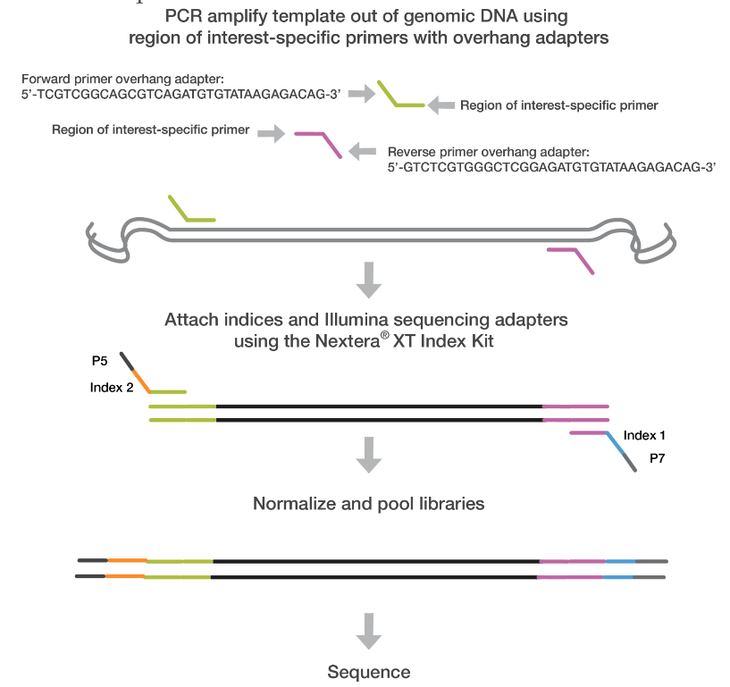
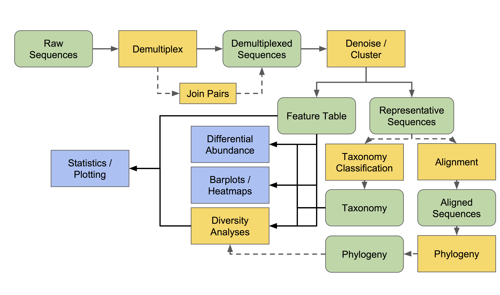
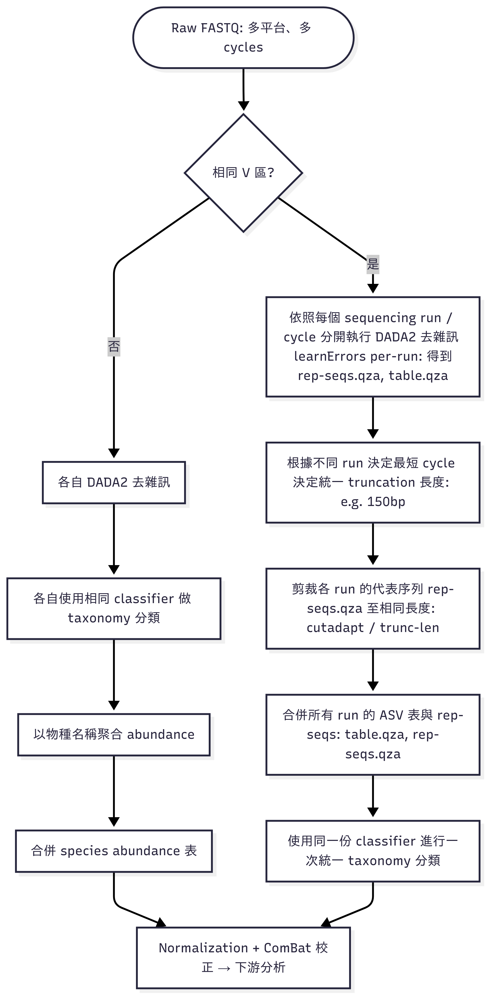

# Table of Content:
此步驟流程只適用於Miseq短序列流程: V3, V4, V3-V4
1. [|Pre-upstream| FastQ files Preprocess：前處理Primer](#FastQ-files-Preprocess-前處理Primer)
2. [|Pre-upstream| QIIME2 - Preparation: 分析前準備](#QIIME2---Preparation-分析前準備)
3. [|Pre-upstream| QIIME2 - Import Data: 導入資料](#Import-Data-and-Preprocessing)
4. [|Post-upstream| QIIME2 - Analysis: 導出特徵表前準備](#Analysis-導出特徵表前準備)


# FastQ files Preprocess 前處理Primer
FastQ現存現象:
* 舊機型上機(2×300 (600-cycle kit)): 有些有設定去除primer，不含primer的序列長度300 bp，但有少部分舊設定保有primer
* 新機型上機(2×300 (600-cycle kit)): 沒有額外設定，序列長度為含primer共計 300 bp
* 解決方法：統一所有FasqQ長度
  + 有prime的序列刪掉要去除掉primer
  + 沒primer的序列則保留不動，不切序列前段


## 啟用cutadapt環境
```
conda activate cutadapt310
```

## 建立一個資料夾放原始fastq檔
在自己的工作資料夾中，建立raw_fastq資料夾，並且移動所有fastq檔案至raw_fastq資料夾
```
mkdir raw_fastq
mv *.fastq.gz raw_fastq/
```

## 下載去除primer腳本與執行
```
curl -o trim_all.sh https://raw.githubusercontent.com/bing020815/FYLab/main/scripts/miseq/trim_all.sh
```

## 賦予執行權限
```
chmod +x trim_all.sh
```

## 執行去除primer腳本
* 腳本會尋找 raw_fastq/*_R1_*.fastq.gz 形式的檔案，請確認你已將 FASTQ 放在正確路徑下（raw_fastq/ 資料夾中）
* 剪完的檔案會輸出至 trimmed_fastq/ 目錄下
* raw_fastq/*_R1_*.fastq.gz 形式的檔案則不會被修改或刪除，需要清理空間時可優先清理這邊
```
./trim_all.sh
```

## 移動統一格式fastq資料至專案資料夾
* 將trimmed_fastq/ 目錄下所有剪完的fastq移動回專案資料夾下
* 會將舊存在的fastq覆蓋掉(原始fastq還是有在raw_fastq裡有保留)
```
mv -f trimmed_fastq/*.fastq.gz .
```

<p align="center"><a href="#fylab">Top</a></p>

# QIIME2 - Preparation 分析前準備

## 對檢體資料清單絕對路徑輸出(更新排除掉'file_path.txt'列入清單)
```
find . -maxdepth 1 -type f \( ! -name 'file_path.txt' ! -name 'trim_all.sh' \) -exec realpath {} \; > file_path.txt
```

## 留下檢體的絕對路徑資料,按照儲存格式存成manifest.csv
* (按照順序: R1_forward, R2_reverse)
``` csv
 # 此為範例格式，無需執行
 sample-id,absolute-filepath,direction
 CH4773,/home/fyadmin/Desktop/Hong-Ying/CL/CH4773_S29_L001_R1_01.fastq.gz,forward
 CH4773,/home/fyadmin/Desktop/Hong-Ying/CL/CH4773_S29_L001_R2_001.fastq.gz,reverse
```
<details>
<summary>(Optional) 確認file_path.txt檔案與處理資料</summary>

(option)確認'file_path.txt'的資料紀錄是否存在
```
cat file_path.txt
```
  (option1): 去除最後一行資料
  ```
  sed -i '$d' file_path.txt
  ```
  (option2): 去除最後一行資料
  ```
  head -n -1 file_path.txt > temp_file.txt && mv temp_file.txt file_path.txt
  ```
  (option3): 手動抓資料下來，移除file_path.txt資料紀錄後上傳上去
  ```
  使用excel修改
  ```

(option)確認file_path.txt的資料紀錄已移除
```
cat file_path.txt
```
</details><br>

## 生成 manifest.csv
```
echo "sample-id,absolute-filepath,direction" > manifest.csv && \
awk -F'/' '
BEGIN { OFS="," }
{
  file = $NF
  split(file, parts, "_")
  sample = parts[1]
  if (file ~ /_R1_/) dir = "forward"
  else if (file ~ /_R2_/) dir = "reverse"
  else next

  key = sample"-"dir
  if (!seen[key]++) {
    print sample, $0, dir
  }
}' file_path.txt >> manifest.csv
```

## 將表有csv轉成逗號分個的txt檔案
* (fastq轉黨qiime2用)
```
cp manifest.csv manifest.txt
```

## 把逗號分隔的csv改成製表符\t的tsv
* (metadata才需要用到)
```
sed 's/,/\t/g' manifest.csv > manifest.tsv
```

<p align="center"><a href="#fylab">Top</a></p>

# Import Data and Preprocessing
* 各專案可能長度與定序段:
  + 2×300 (600-cycle kit): MiSeq; V3–V4 (341F–805R)
  + 2×250 (500-cycle kit): MiSeq、HiSeq; V3–V4、V4
  + 2×200 (400-cycle kit): MiniSeq; V4（515F–806R）
  + 2×150 (300-cycle kit): NextSeq, NovaSeq, HiSeq ; V4
  + 2×100 (200-cycle kit): HiSeq; V4
* 各專案合併解決方法，可以依據目標段區域分類進行特殊狀況處理：
  1. [分流前處裡、ASV切齊、ASV合併、分類](#特殊狀況處理1-optional)
  2. [分流前處裡、分流分類、Taxa合併](#特殊狀況處理2-optional)

### 依據 [DADA2 官方 Big Data 工作流程](https://benjjneb.github.io/dada2/bigdata.html)
原文：“recommended to learn the error rates for each run individually … then merging those runs together into a full-study sequence table.” [在說明文件同頁也明講 “Sequences must cover the same gene region … Single-reads must also be truncated to the same length. (this is not necessary for overlapping paired-reads, as truncLen doesn’t affect the region covered by the merged reads)”]，

作者（Ben Callahan）在 GitHub issues 的逐字回覆:
+	“In order to successfully merge, your amplicons need to cover the same gene region. … So to merge, you need to trim the longer ASVs to exactly the gene region included in the shorter ASV table.”（[Issue #452](https://github.com/benjjneb/dada2/issues/452)） 
+	“As long as the datasets are from amplifying the same gene region, they can be simply merged (i.e. the ASVs will be consistent across the …).”（[Issue #482](https://github.com/benjjneb/dada2/issues/482)） 
+	“Just make sure to trim each run to the same gene region (i.e. same trimLeft for merged paired-end data, and same trimLeft and truncLen for …).”（[Issue #716](https://github.com/benjjneb/dada2/issues/716)）

QIIME 2 論壇（佐證 truncLen 與覆蓋區）:
+	“It’s fine to use different truncLen … The truncLen setting doesn’t affect the merged amplicon region, it just affects the amount of overlap …”（[QIME 2 Forum]((https://forum.qiime2.org/t/dada2-merging-and-comparing-different-data-sets/18326))） 

上述出處可以整體整理為幾點處理要點：
1) 「每個 sequencing run 應獨立學習錯誤率並進行樣本推斷（Sample Inference）」
2) 「各 run 完成後合併為全研究用的 sequence table」
3) 「合併前需確保序列涵蓋同一基因區（same amplicon region）」
4) 「嵌合體去除 (chimera removal) 與分類學指派 (classification) 可於各 run 或整體階段執行」



## 進入qiime2環境
```
conda activate qiime2-2023.2
```

## FASTQ 匯入轉檔 QIIME 2 可使用的格式 (.qza)
* (need to wait process time, use 'top' command to check, press 'q' to leave)
* 會產出 paired-end-demux.qza 檔案(檔案肥大，如需清理空間可優先清除)
* 依照manifest.txt將兩段序列配對打包封裝起來(未實際拼接兩段序列)
```
nohup qiime tools import --type 'SampleData[PairedEndSequencesWithQuality]' --input-path manifest.txt --output-path paired-end-demux.qza --input-format PairedEndFastqManifestPhred33 &
```

## 轉成可視化報表
* 利用 qza 檔案，轉黨輸出成qzv，可以畫成可視化報表
* https://view.qiime2.org/
```
nohup qiime demux summarize --i-data paired-end-demux.qza --o-visualization paired-end-demux.qzv &
```

## Denoise 去除雜訊 [標準流程: 270-240 (適用於fastq長度 300 bp)]
* 將qza檔案去完雜訊後，輸出成： table.qza, stats.qza, rep-seqs.qza 
* (need to take a long process time, use 'top'/'htop' command to check, press 'q' to leave)
* --p-trim-left-* 的數值應根據使用的 primer 長度設定，無法指定單獨的樣本做。
* --p-trunc-len-* 需保留足夠長度供 forward + reverse read 重疊（overlap）至少約 12 bp。
* 成功合併的條件公式: trunc_f – trim_f  +  trunc_r – trim_r  ≥ amplicon + min-overlap
* amplicon 則是 PCR 目標要放大的序列斷，可用於對應 reference Database 對照使用 (ex: Greengenes V3V4)
* 例如：270 + 240 = 510，V3-V4的 amplicon 長度為 約430~460 bp(可通則預設為460)，則 overlap 為 50 bp，屬於合理值(overlap 通常建議 >20-30 bp)
* (將雙端測序數據處理為高品質的序列數據，並輸出相關結果)
* 流程會先各自: (1)品值篩選 → (2,3) 建立錯誤模型、denoise（F / R）→ (4) 再合併 → (5) 再去 chimera → 再輸出 ASV
* 不足trucLen的reads會被剃除、去除可能是拼接自高豐度序列的 chimera (default method:consensus)
* table.qzv - 可以看到Sample的取樣深度
<details>
<summary><strong>檢查Fastq實際長度 [2025829 新增]</strong></summary>
  
  * 根據實際fastq長度，調整trunc範圍，以防因未達到條件被dada2大量去除
  * 如果使用短序列，通常要使用reads數最多的長度作為切點

抽樣查詢長度  
```
  zcat YourFastq_R1_trimmed.fastq.gz | \
  awk '(NR%4==2){print length($1)}' | \
  sort | uniq -c
```
查看整批所有長度
```
  zcat *.fastq.gz | \
  awk 'NR%4==2 {print length($0)}' | \
  sort | uniq -c | \
  awk '{print $2 "\t" $1}' | \
  tee >(awk '{sum+=$1*$2; n+=$2; if(min==""||$1<min)min=$1; if($1>max)max=$1} END{print "N="n, "Min="min, "Mean="sum/n, "Max="max}' >&2)
```
輸出所有長度清單 
```
  for f in *.fastq.gz; do
    mode=$(zcat "$f" | \
      awk 'NR%4==2 {print length($1)}' | \
      sort | uniq -c | sort -nr | head -1 | awk '{print $2}')
    echo -e "$f\t$mode"
  done > fastq_length_mode_list.txt
```
</details>

```
nohup qiime dada2 denoise-paired \
--i-demultiplexed-seqs paired-end-demux.qza \
--p-trim-left-f 0 --p-trim-left-r 0 \
--p-trunc-len-f 270 --p-trunc-len-r 240 \
--p-n-threads 2 \
--o-representative-sequences rep-seqs.qza \
--o-table table.qza \
--o-denoising-stats stats.qza > nohup.out 2>&1 &
```
## 紀錄denoise設定
```
echo "--p-trim-left-f 0 --p-trim-left-r 0" >> denoise_settings.txt
echo "--p-trunc-len-f 270 --p-trunc-len-r 240" >> denoise_settings.txt
```

### 檢查stats檔案denosis狀態圖表
* 利用 qza 檔案，轉黨輸出成qzv，可以畫成可視化報表
* stats.qzv - 確認denoise中的資訊。
* https://view.qiime2.org/
```
qiime metadata tabulate \
  --m-input-file stats.qza \
  --o-visualization stats.qzv
```
### 直接看序列表長度[optional]
* (產出rep-seqs-summary.qzv)
```
qiime feature-table tabulate-seqs \
  --i-data rep-seqs.qza \
  --o-visualization rep-seqs-summary.qzv
```

### 特殊狀況處理1 (optional)
<details>
<summary><strong>合併分流專案 [20251008 新增]</strong></summary>
  
  ## 根據實際專案需求，合併不同分流的專案
  * 分流專案A、分流專案的table.qza, rep-seqs.qza 複製到獨立資料夾
  * 將分流專案A的table.qza與分流專案B的table.qza合併
  * 將分流專案A的rep-seqs.qza與分流專案B的rep-seqs.qza合併

### 建立合併後導出用資料夾
創建合併導出用的資料夾，複製移動必要檔案(table.qza, rep-seqs.qza)，在此資料夾下進行合併、分類等步驟
```
  mkdir merge_exported
  cd merge_exported
```
根據要合併的專案群決定需要切齊的統一長度(最小的長度)
```
qiime cutadapt trim-reads \
  --i-demultiplexed-sequences rep-seqs1.qza \
  --p-length 430 \
  --o-trimmed-sequences rep-seqs1_trimed.qza

qiime cutadapt trim-reads \
  --i-demultiplexed-sequences rep-seqs2.qza \
  --p-length 430 \
  --o-trimmed-sequences rep-seqs2_trimed.qza
```
table.qza: ASV abundance table（特徵豐度表、又稱 feature table，帶有ASV ID）
```
  qiime feature-table merge \
  --i-tables table1.qza \
  --i-tables table2.qza \
  --o-merged-table table.qza
```
rep-seqs.qza: 每個 ASV 的實際 DNA 序列（即 16S 片段字串），實際需要合併，以及用於分類器分類的 input，實際需要合併，以及用於分類器分類的 input
```
  qiime feature-table merge-seqs \
  --i-data rep-seqs1_trimed.qza \
  --i-data rep-seqs2_trimed.qza \
  --o-merged-data rep-seqs.qza
```
[跳至倒出特徵表步驟](#Analysis-導出特徵表前準備)

</details>
<p align="center"><a href="#fylab">Top</a></p>

# Analysis 導出特徵表前準備
## 建立導出用的資料夾
```
mkdir phyloseq
```
## 轉黨qza檔案成biom檔案
* 輸入去除雜訊後的table.qza，再輸出成biom format: feature-table.biom
```
qiime tools export \
--input-path table.qza \
--output-path phyloseq
```

## Biom 轉黨
* 將輸出成biom format的當案轉黨成otu_table.tsv 
* biom 記錄樣本與 OTU/ASV 之間的豐度矩陣
```
biom convert \
-i phyloseq/feature-table.biom \
-o phyloseq/otu_table.tsv \
--to-tsv
```

[接續回到主要共同步驟](../README.md)

<p align="center"><a href="#fylab">Top</a></p>
