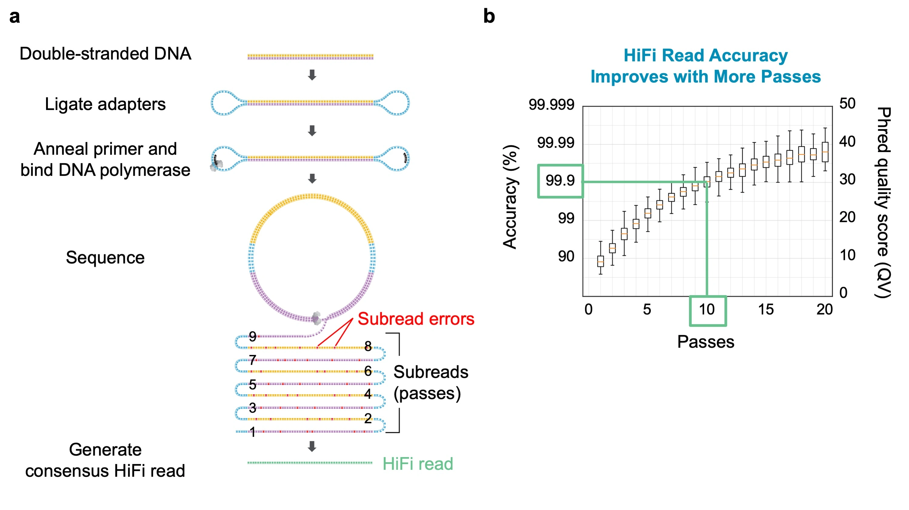

# PacBio transform .bam to .fastq.gz
用於 PacBio HiFi 16S 下機資料 bam 檔案轉檔成 fastq.gz 的前置作業。
```
Vega HiFi BAM
      │
      │ + barcode FASTA
      │ + list.xlsx
      ▼
     Lima
 ASYMMETRIC Mode
      │
      ▼
辨識 Forward + Reverse barcode
      │
      ▼
用 list.xlsx 篩選 [由使用者提供的]
      │
      ▼
根據 Sample ID 清單，只留下有 Sample ID 的樣本
      │
      ▼
SampleID.hifi_reads.fastq.gz
```

# Table of Contents:
1. [|下機前除裡| 工具介紹](#工具介紹)
2. [|下機前除裡| 轉檔fastq](#建立官方-workflow)

# 工具介紹
## list.xlsx
`list.xlsx` 是由使用者提供的 barcode pair 與 Sample ID 對照清單，記錄每個樣本所使用的 Forward barcode 與 Reverse barcode。
```
ID        forward_name    f_sequence     reverse_name    r_sequence
Sample01  bc1005          ACTG...          bc1033          TGCA...
Sample02  bc1005          ACTG...          bc1035          CAGT...
Sample03  bc1007          GTCA...          bc1033          TGCA...
```

## Lima
[`Lima`](https://lima.how/get-started) 是 PacBio 的 barcode demultiplexing 工具。判斷每條 HiFi read 兩端所對應的 barcode，進行 barcode demultiplexing，並將 barcode 資訊寫入輸出的 BAM。
```
m21201_260820_072001.hifi_reads.bam
              │
              │ + barcode FASTA
              ▼
             Lima
              │
       ┌──────┼──────┐
       ▼      ▼      ▼
    F1-R1   F1-R2   F2-R1 ...
              │
              ▼
        demultiplexed BAM
```

## bam2fastq
`bam2fastq` 負責將 Lima 處理完成的 PacBio BAM 轉換成 FASTQ.gz。
```
Lima demultiplexed BAM
          │
          ▼
      bam2fastq
          │
     --split-barcodes
          │
     ┌────┼────┐
     ▼    ▼    ▼
   F1-R1 F1-R2 F2-R1
     │    │    │
     ▼    ▼    ▼
  FASTQ.gz ...
```


# Lima
由 PacBio SMRT 定序技術產生的長片段、高準確度基因定序數據。
* 透過「環形一致性定序（CCS）」技術，將單一 DNA 分子重複讀取並校正，廣泛應用於基因組組裝、變異檢測、以及單倍型定相。


* [Wenger, A.M., Peluso, P., Rowell, W.J. et al. Accurate circular consensus long-read sequencing improves variant detection and assembly of a human genome. Nat Biotechnol 37, 1155–1162 (2019)](https://doi.org/10.1038/s41587-019-0217-9)

<p align="center"><a href="#PacBio-transform-.bam-to-.fastq.gz">Top</a></p>


# 轉檔Fastq
移動到指定 run 的 `hifi_reads.bam` 所在的資料夾，並執行以下指令：
```bash
pacbio-demux2fastq-start
```

查詢轉檔狀態
```bash
pacbio-demux2fastq-stats
```

[回到主要流程](../README.md)

<p align="center"><a href="#PacBio-transform-.bam-to-.fastq.gz">Top</a></p>

